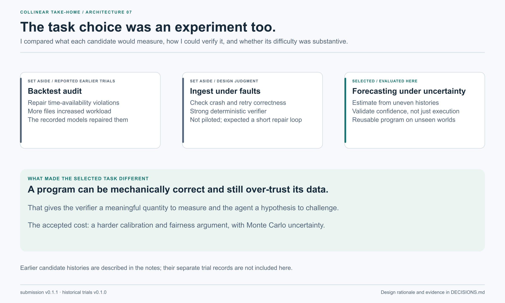

# Why I built it this way

**Siddharth Shashank Kumar · t20-exact-forecast**

I wanted to distinguish a working program from a justified forecast. A submission can parse every file, use the correct simulator and produce a valid answer while still trusting noisy player estimates too much. That is the failure I designed this task to investigate.

This is a retrospective account of the decisions recorded in the repository, not a claim that every sentence was written before the experiments. I distinguish measured results from design judgments and later interpretations. The pass rule has a verifiable boundary for the shipped evidence: commit `99b2d9f` precedes the archived evaluation series. The older notes describe an earlier prototype and pilots in another repository; this commit alone does not verify that earlier chronology.

Read [the run report](RUN_REPORT.md) for trial identities and [the assumptions](ASSUMPTIONS.md) for what remains untested.

## The choices that shaped the task

| Decision | What I was trying to avoid | What I chose |
|---|---|---|
| Task family | More files being mistaken for more reasoning | Inference and validation under uncertainty |
| Source of difficulty | Undocumented rules or domain trivia | A public mechanism with unknown quantities |
| Evaluation | A lucky match result deciding the grade | Expected loss against stored probability estimates |
| Pass rule | One unusually noisy world deciding everything | Pooled regret, plus a held-out-only check |
| Failure analysis | Treating every failure as missing validation | Inspect which checks were run, then intervene on the fitted priors |
| Reporting | Improving the story after seeing the results | Keep the rule, report the passes and qualify the misses |

## 1. I changed the problem, rather than making the first one larger

My first direction was a backtest audit: repair scripts that used information unavailable at forecast time. The development record says the named models repaired the violations even as the repository grew. That changed my working hypothesis. For this candidate task, more locations to inspect increased workload without creating the kind of failure I needed.

I also considered an ingest service checked under a declared fault model. It offered a strong verifier, but I expected a short repair-and-test loop to be effective. I set it aside without model pilots. That was a judgment call, and I cannot present it as an observed model pass.

I chose forecasting because a mistake in the strength of an estimate can survive an otherwise correct implementation. The next experiment would test whether an agent could recognize that uncertainty and build a check for it.

**Tradeoff.** I gave up a cleaner software-correctness specification and took on calibration, statistical uncertainty and a harder fairness argument.

**Evidence boundary.** These earlier candidates are described in the [original decision record](https://github.com/siddharthshashank/collinear-siddharthshashankkumar/blob/3c28a55/t20-exact-forecast/DECISIONS.md). Their trial records are not shipped here. I retain that account as background, not independent evidence that either task was too easy.

## 2. I used a simulated cricket league to make the answer measurable

I needed a setting with repeated observations, interpretable outcomes and an affordable way to generate fresh instances. Twenty20 cricket gave me player-level records and a bounded match length. Cricsheet supplied a calibration source, so I could ground aggregate behavior in observed data.

I chose invented players, teams and grounds. That prevents a familiar player's reputation from becoming an alternative source of information. The useful evidence has to come from the league folder.

The larger reason for simulation was evaluation. A 70% forecast can be sound even when its team loses. With a simulator and the hidden state, I can estimate the underlying probability and evaluate the forecast against it.

**Alternative.** Real fixtures would be easier to explain as a business problem, but one set of realized results would add substantial noise to the grade. An uncalibrated toy league would be easier to build, but harder to defend as a realistic task.

**Cost.** The task tests inference inside this simulator. It does not establish accuracy on real cricket, and its stored probabilities still have Monte Carlo error.

**Evidence.** `league/world.py`, `dev/make_task_data.py`, [provenance](PROVENANCE.md), and [the calibration design](DESIGN_DOCUMENT.md#why-cricket-and-how-realistic-is-it).

## 3. I made the mechanism public and left the quantities to be inferred

I shipped the engine because I did not want an agent to fail by misunderstanding an informal description of cricket. Every solver can inspect how a ball, innings and match are simulated.

The unknowns are the player abilities and the sizes of the documented effects. The handbook describes their structure, including the absence of a separate batter–bowler pair effect. It also gives the scoring rule and a rough baseline.

That makes the difficulty more specific: can the agent estimate quantities from limited records, rather than guess what the task author meant?

**Cost.** The engine gives the solver a useful testing tool. A capable agent can generate its own leagues, and the passing programs used that opportunity. I accept that: a fair route to a solution should be available.

**What the runs exposed.** Providing a testing route is not enough. Opus run 3 generated its own validation worlds and inferred a reference score from the handbook's rough coin-flip comparison. GPT-5.5 runs 2, 4 and 6 instead tested forecasts against past match outcomes. Those are different limitations: a synthetic test can assume the distribution it needs to investigate, while a legitimate historical backtest can be too noisy or too weak a comparison to establish the required forecast quality.

**Evidence.** The packaged handbook and engine; [failure analysis](RUN_REPORT.md#7-failure-analysis).

## 4. I limited realism to what I could explain and inspect

It would have been easy to add more cricket detail. I instead separated measured constants from chosen ones and kept the game mechanism small.

The calibration explored which effects repeated across parts of the archive. That informed the choice to include venue effects and a modest batter-at-venue effect, while omitting a separate parameter for every batter–bowler pair. Weak repeatability is a reason to simplify this benchmark; it is not proof that the effect never exists in real cricket.

I also fixed the bowling rotation and made the toss winner chase. A captain's decision policy would add another hidden process. I wanted the challenge to remain about estimation, not reconstructing an unobserved strategy.

**Cost.** Some aggregate targets were used to tune the simulator. Matching them is calibration, not independent validation. The simplified game also limits any claim about real-world predictive performance.

**Revisit if.** An omitted effect can be supported by repeatable evidence and added without making the agent's contract ambiguous.

**Evidence.** `league/calibration.py`, `dev/fit_constants.py`, and [engineering notes](NOTES.md).

## 5. I used changing line-ups and several seasons to make the program reusable

The forecast is about the announced players, not just the team label. Transfers and rotating elevens make that distinction matter. Three seasons provide repeated observations, while uneven appearances and future form drift leave a meaningful uncertainty problem.

The deliverable is a program that accepts an arbitrary league folder. Seven additional worlds test whether it learned a method rather than a set of answers for the visible league.

**Alternative.** One visible dataset would reduce grading cost, but it would be easier to hand-tune. A much longer history could make weak estimates converge toward the right answer without requiring good uncertainty handling.

**Cost.** Generalization is tested within one generator family. Eight worlds are not eight different real-world domains.

**Evidence.** `league/world.py`, the eight committed league folders, and `dev/make_task_data.py`.

## 6. I chose logarithmic regret because confidence is part of the answer

I wanted the score to distinguish a mildly wrong forecast from a confidently wrong one. Logarithmic regret makes that distinction directly. Brier score would also be a defensible choice; I chose log loss because overconfidence was the failure hypothesis I wanted to examine.

I clipped submitted probabilities to [0.002, 0.998] so an endpoint could not create an infinite score. I kept descriptive comparisons separate from the pass rule.

**Cost.** The score is less intuitive than “matches predicted correctly”. The documentation therefore explains it in terms of the extra loss from reporting `q` instead of the stored probability `p`.

**Evidence.** `scoring/exact.py`, `harbor/tests/grader.py`, and the hand-calculable score check recorded in [validation](VALIDATION.md).

## 7. I abandoned a per-world threshold after checking its noise

My first idea was to require an acceptable result on every world. The development runs made that difficult to justify. In [bar.log](bar.log), reference simulation variation reaches 5.8% on one world, while an unshrunk method is only 6% or 8% worse than the reference on others.

That creates a conflict: a loose threshold absorbs noise but lets a weak method through; a tight one can reject a sound method on an unfavorable world. I changed the unit of judgment to pooled regret.

I then added a second application of the rule on the seven held-out worlds alone. The visible world should not be able to carry a method that fails to generalize.

**Cost.** A weak result on one world can be offset elsewhere. That is an intentional aggregate criterion, not a guarantee of good performance on every fixture or league.

**Evidence.** [Research design figure](figures/research_ladder.png), `dev/bar_analysis.py`, [bar.log](bar.log), and the two-rule checks in [validation](VALIDATION.md).

## 8. I kept the committed 10% tolerance for the archived trials

Ten percent was a design choice informed by the development comparisons, rather than a uniquely optimal statistical cutoff. The rounded records in `bar.log` put the pooled no-shrinkage comparison at about 1.27 times the reference. A 1.10 limit left some room above the reference while still rejecting that comparison. Commit `99b2d9f`, dated 23 September at 18:59 CDT, precedes the first archived model job at 19:48 that day. The historical notes describe earlier work elsewhere; I cannot use this commit to certify that all task-development decisions preceded every earlier experiment.

When GPT-5.5 reached 1.109 times reference regret, moving the limit to 1.12 would have changed that verdict. I kept the original rule.

The review exposed a distinction I had underemphasized: preserving a rule does not make a near-threshold result a strong measurement. The often-quoted 1.14% pooled variability is an approximation computed from rounded per-world standard deviations, assuming zero covariance. The reference simulations reused seeds across worlds, and the log does not retain the repeat vectors needed to measure their covariance. I therefore cannot treat 1.14%, or the earlier 1.08–1.12 caution range, as measured uncertainty bounds. The two near misses remain weak evidence of separation; clear misses elsewhere carry the failure claim.

**Next measurement change.** Retain the full per-world, per-repeat score matrix, vary simulation streams explicitly, and measure the pooled score directly before choosing a new reference or threshold. I would not apply a new denominator retroactively.

**Evidence.** `harbor/bar.json`, commit `99b2d9f`, [run report, Section 2](RUN_REPORT.md#2-the-rule-behind-every-verdict).

## 9. I accepted a reference-design shortcut that I would now replace

The reference reads the same public files as an agent at runtime. However, I chose its base prior scales knowing the generating spreads. That is a real advantage in its design, even though hidden player values are not passed into its runtime.

The 10% tolerance gives some room around the reference, but I have not measured how much of the reference's performance comes from that prior knowledge. Passing agents that learned scales from data demonstrate a viable solution route; they do not quantify the advantage.

**Alternative.** Use a reference that estimates its own prior scales. That would make the fairness argument cleaner.

**Why retain this denominator.** Changing it after the recorded trials would create a different forecasting experiment. I keep the original reference and threshold while disclosing the limitation, including the original handbook's understated description of the reference. Verifier hardening is versioned separately; it does not make the reference fairer.

**What I would change first.** A learned-scale reference, followed by a fresh bar analysis and new trials. This takes priority over making the task harder.

## 10. I made the oracle and the no-op control part of the design

A score is only useful if the surrounding system works. The oracle shows that a program using the required interface can pass; the no-op control checks that valid formatting alone is insufficient.

The first oracle run caught a shell assignment error that a syntax check had missed. The reference was never installed, so the verifier graded the starter. I retained that failed run and its successful replacement instead of treating the first result as a task failure.

I separated the verifier from the agent environment and intended to run submitted code as an unprivileged user. That design reduces exposure, but intent is not enough: the later review found a path through symlinked submission files that needed an explicit adversarial check.

**Cost and limit.** Isolation adds packaging complexity. The original verifier has network, artifact-boundary and process-cleanup weaknesses; the LLM task review did not establish security. Verifier hardening is tracked as a new version with its own controls and replay evidence, rather than quietly credited to the original trials.

**Evidence.** [Controls](RUN_REPORT.md#4-positive-and-negative-controls), [runtime design](figures/harbor_runtime.png), and [known verifier weaknesses](RUN_REPORT.md#10-verifier-design-and-failure-interpretation).

## 11. I treated forecast resemblance as a lead, then tested the explanation

The weak-method comparisons gave the failed forecasts a recognizable pattern. That was useful for deciding where to inspect, but not enough to establish a cause.

The recorded analysis changed one prior or hedge setting at a time in the first six programs on held-out world c. Their original outputs first reproduced the archived scores. The interventions moved scores in the direction predicted by the diagnosis. Reading the transcripts adds an important correction: all three GPT-5.5 programs had attempted chronological predictive checks, and run 6 also compared recency and probability-hedge settings. It would be inaccurate to describe them as doing no accuracy validation.

For example, raising Opus run 1's common ridge penalty from 1 to 25 reduced its world-c ratio from 2.70 to 1.36. Halving GPT-5.5 run 6's prior standard deviations, retaining its hedge, moved 1.42 to 0.91.

**What I can conclude.** Those prior choices materially affected those programs on that world. Their own validation did not reveal enough evidence to correct them before submission. For GPT-5.5 run 2, beating a coin flip on 90 past matches was a useful check, but it did not establish performance within 10% of a stronger reference on unseen worlds.

**What I cannot conclude.** One edit would make every program pass all eight worlds, or that all ten failures have the same proven cause. Runs 7–10 have resemblance evidence only.

**Evidence.** [ablations.log](ablations.log), `dev/ablate_pilots.py`, and [the full analysis](RUN_REPORT.md#7-failure-analysis).

## 12. I reported the passes and the interruptions as part of the result

The full brief names GPT-5.5-high / Opus 4.7 in its goal and run requirement, and GPT-6-astra-high / Fable 5.1 in its target-outcome paragraph. The development record includes both pairs.

I treat the explicit goal and run requirement as the primary target, while reporting the other pair separately. That is an interpretation, not a resolution supplied by Collinear. Under the stricter reading that requires a clean newer-pair failure, this version does not establish the requested result: four of five completed newer-pair trials pass, and the remaining miss is borderline.

I also distinguish a graded submission from an uninterrupted session. GPT-5.5 run 8 wrote its program before an account limit ended the session. Its score is evidence about that artifact, but weaker evidence about what the model could do with the full budget. The report gives the count with and without it. Four other interrupted jobs are excluded and listed.

**Why this matters.** Relabeling passes, hiding interruptions, or tightening the task after seeing the scores would make the submission less informative.

**Evidence.** [Assignment](ASSIGNMENT_BRIEF.md), [required-model trials](RUN_REPORT.md#5-required-model-trials), and [other trials and exclusions](RUN_REPORT.md#6-supplementary-trials-and-exclusions).

## 13. I revised the claims before changing the experiment

The independent review identified attribution errors, overstated precision, an unmeasured reference advantage and verifier weaknesses. The first documentation revisions preserved the evaluated runtime. The deeper audit then found that documentation alone was insufficient for the artifact boundary.

I separate those responsibilities now: preserve the original v0.1.0 jobs as observations, identify the verifier hardening as v0.1.1, and validate the new version with its own controls, an archived-program replay and a fresh model attempt. The v0.1.1 oracle passes, the replay preserves its original score, and the new GPT-5.5-high artifact misses both forecast gates while meeting the interface and constraint checks. That fresh agent also performed predictive backtests; I retain the same distinction between observed failure and an unproven explanation of its cause. A replay checks an existing artifact under the revised verifier; it is not a new model attempt. Historical results should never be relabeled as fresh v0.1.1 trials.

The same discipline applies to the explanation. Correcting the account of the GPT programs' validation makes the report more accurate; it does not strengthen their recorded failure margins.

**Evidence.** [Review responses](RUN_REPORT.md#13-independent-review), [runtime hashes and checks](VALIDATION.md), and [figure provenance](PROVENANCE.md#drawings-and-independent-review).

## What I would do differently

I would spend the next iteration on the measurement before increasing difficulty: learn the reference priors from data, quantify its variation, audit the stored probabilities with independent random streams, and harden verifier isolation. Then I would run a human baseline and new model trials under a new committed rule.

The result I can defend is narrower than “these models cannot forecast”. Several programs implemented the mechanism and attempted sensible checks, yet retained prior choices that hurt their forecasts on the evaluated worlds. The task makes the gap between running a test and obtaining decisive evidence visible. The same standard applies to my own reference, threshold and verifier.
