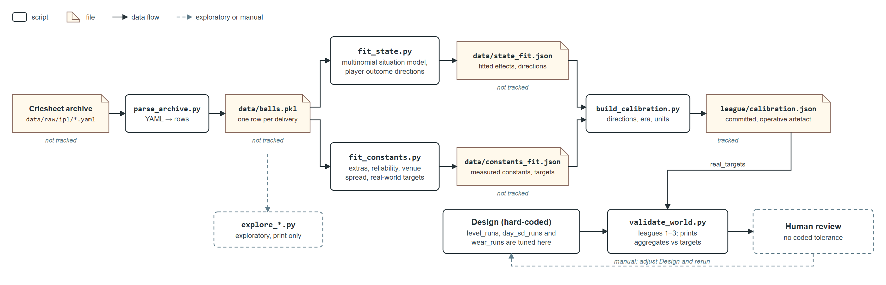
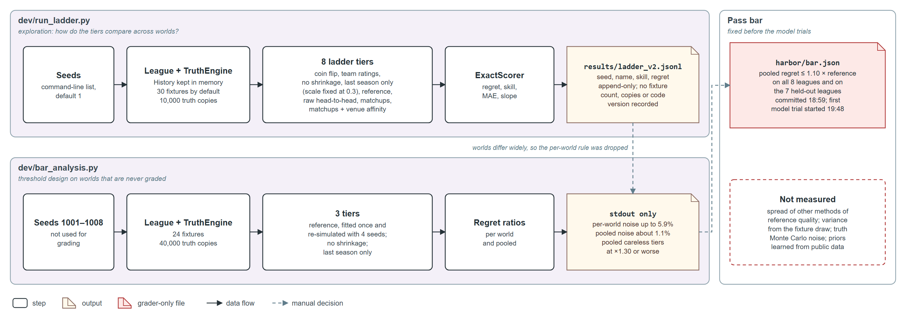
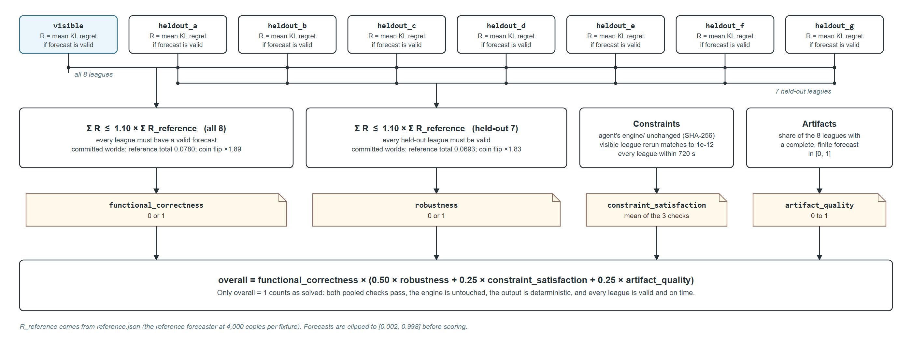
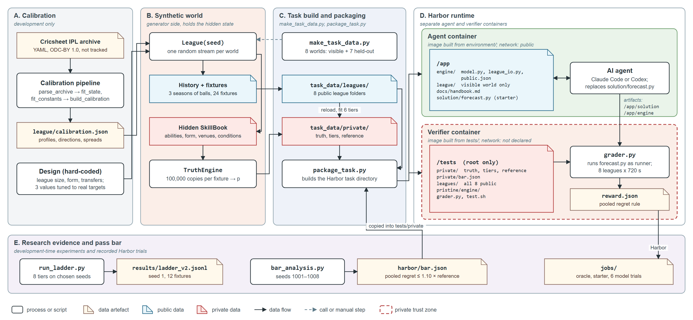
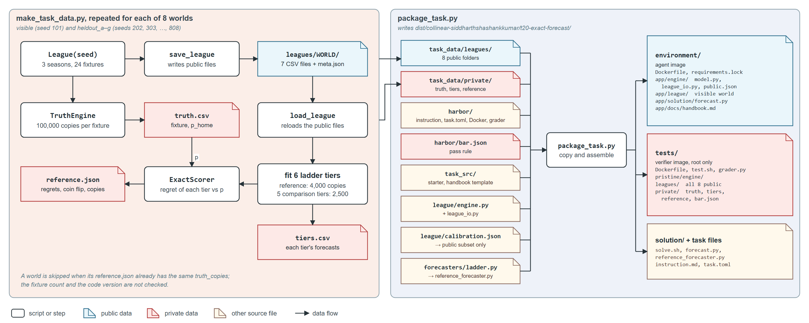
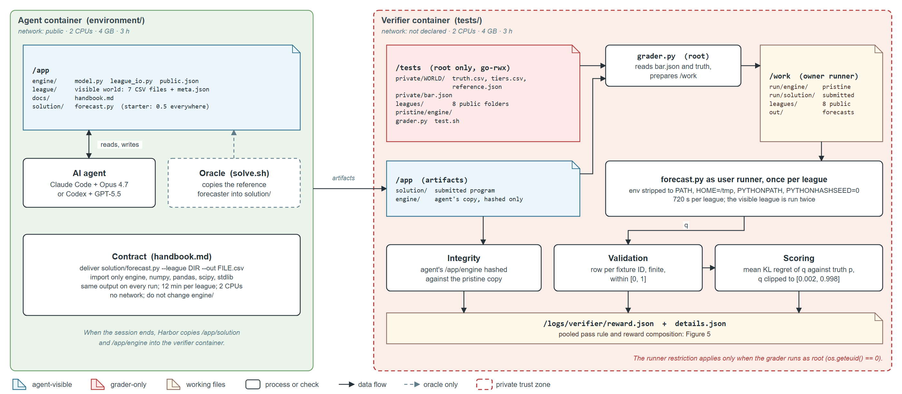
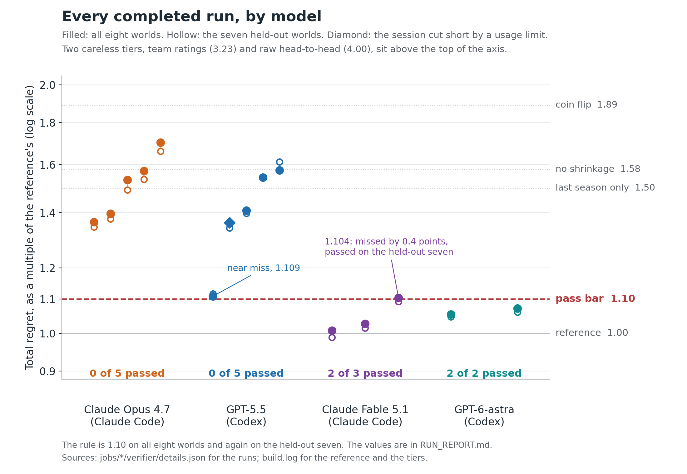

# Learning what to trust

## A forecasting task for AI agents, graded against the exact truth

**Author:** Siddharth Shashank Kumar
**Task:** `collinear-siddharthshashankkumar/t20-exact-forecast`
**Repository:** github.com/siddharthshashank/collinear-siddharthshashankkumar

---

### In one paragraph

I wanted to know whether today's AI coding agents can do the thing that separates a good forecaster from a bad one: look at a noisy history, decide how much of it to believe, and build a check that could tell them they are wrong. To measure that cleanly I built a Twenty20 cricket league that exists only inside a simulator, calibrated it to 295,557 real IPL deliveries so it behaves like cricket, hid every player's true ability, and asked the agent to forecast next season's matches from three seasons of records. Because I generated the league, I know the true probability of every match, so a forecast is graded on its distance from the truth, not on whether one match happened to go one way. The pass mark was fixed before any model ran. The two models the brief names failed ten times out of ten, all for the same reason, which I confirmed by editing their programs; the next generation of the same two model families passed four times out of five by doing exactly what the failures skipped. The bar sits between the generations, and that is the result.

---

## 1. The question

### What am I trying to find out?

Whether an agent, given data and tools and time, can tell signal from noise and act on the difference. Not whether it can write a forecasting program; the strongest models write fine programs in minutes. Whether it can decide how much of a player's short record is real, turn that into calibrated probabilities, and, most of all, build a test capable of catching its own mistake before it submits.

### Why that skill?

Because it is the one I have watched go wrong most often in real forecasting work, in disease surveillance, in demand planning, in every place a decision hangs on a small sample. The pipeline runs, the numbers look plausible, and a lucky streak of forty balls has been treated as a permanent difference. The failure is silent. No test turns red. Only a check that asks "does my model's confidence match how much data I actually have?" can see it, and that check has to be built deliberately.

### Why does a benchmark need to exist for it?

Because the usual way of grading forecasts cannot see the mistake either. If you grade a forecast by what happened, luck grades it. A forecaster who says 70 percent and loses was not necessarily wrong; three times in ten that is exactly what should happen. Over the 192 matches this task grades, the noise that comes from results alone is about twice the gap between a careful forecaster and a careless one.[^1] A results-graded task would be flipping a coin about which agent is better. I needed a task in which the truth is knowable, so that the grade is about the forecast and nothing else.

### What would count as an answer?

Three things, and I committed to all three before running a model. A pass mark that a careful, ordinary statistical method clears and that hurried shortcuts do not. Evidence that if a model fails, it failed for the reason the design predicts, and not for an infrastructure reason. And the honesty to report whatever the models did, including passing.

---

## 2. Two experiments that were wrong before this one was right

This is not the first task I built for this brief. It is the third, and the first two taught me what the third had to be.

**The backtest audit.** A repository of forecast scripts, each of which quietly used revised data that was not available on the day the forecast was made. One written rule, violated in eight, then twenty-four, then forty-eight places. A real problem from my own work, and a proper verifier. Claude Opus 4.7 and GPT-5.5 fixed every violation at every size.[^2] More files made more work, not more difficulty. The lesson: a capable agent implements anything it can read. Difficulty that lives in a rule the agent can read is not difficulty for these models.

**The exactly-once ingest service.** A service that must stay correct under every crash and every redelivery, checked against 27,710 fault schedules.[^3] An excellent verifier, and a short fix-and-test loop that I judged the top models would close. I parked it without piloting it; that was a judgement, not a measurement, and I say so.

**What the third task had to have.** Difficulty that is statistical rather than specificational: a program can be correct in every line and still be wrong, because the wrongness is in how much it believes the data. And a grade that a computer can produce without a human judging anything.

---

## 3. The idea: own the truth

### Why a simulated world?

Three reasons, in order of importance. First, exact truth: if I generate the league, I know the probability of every fixture, so there is no luck in the grade. Second, no leakage: real players have reputations, and an agent that knows a famous name is scoring well would be rewarded for memory rather than inference; in my league only statistics survive from reality, no name does. Third, unlimited fresh worlds: I can generate seven more leagues the agent never sees and test whether its program generalises.

### What does a simulated world give up?

Any claim about real cricket. The world is a statistical model of the IPL, not the IPL. I say this everywhere it matters, and the task does not depend on it: the agent is judged on inference inside a world whose rules it is given.

### Isn't a synthetic world artificial in a way that makes the task easy or arbitrary?

It would be if the simulator were a toy with made-up numbers. So the effects in the world are the ones that measurably exist in fifteen years of real data, at the sizes they exist, and the things that do not exist in the data were left out. Section 5 is about how.

---

## 4. Why cricket, why Twenty20, why the IPL

### Why a sport?

Sport gives you thousands of small, repeated, independent observations of the same people under measurable conditions, with an outcome everyone understands. "The home side has a 70 percent chance" needs no explanation. A synthetic target in an invented domain would.

### Why not football or basketball?

Football has too few scoring events per match to separate skill from luck at the level of individual players. Basketball has plenty of events but the public play-by-play data is not free and complete in the way cricket's is. Baseball would have worked, and has the richest tradition of exactly this kind of statistics; cricket won on the openness of the data and on the next point.

### Why Twenty20 and not the longer formats?

A T20 innings is at most 120 legal balls and a match is over in a few hundred, so a whole match simulates in milliseconds and a fixture can be played hundreds of thousands of times to pin its probability down. Test matches run to thousands of balls with declarations and draws; fifty-over cricket is in between. T20 is also the format with the most matches per season in one league, which means the most repeated observations of the same players.

### Why the IPL specifically?

Cricsheet publishes every ball of every IPL match since 2008, free, complete and under an open licence: 1,243 matches, 295,557 deliveries.[^4] Each delivery records who bowled it, who faced it, where, in what situation, and what happened. That is exactly the raw material from which you can separate a player's ability from the situation he was in.

### What did the real data say, and why is it the centre of the task?

The one number that shaped everything. Rank the batters by scoring rate in one half of a season, then look at the other half: the correlation is about 0.46. Do the same for bowlers' economy: about 0.27.[^5] Roughly half of what separates one batter's season from another's is chance, and for bowlers more than half. A forecaster who takes recent numbers at face value will be badly overconfident. That is real cricket's trap, and I did not invent it; I measured it and built the world so that it is exactly as large as in reality.

### What is shrinkage, concretely?

Suppose a new batter has faced forty balls and scored at a rate that would make him the best in the league. Forty balls is nothing; the honest estimate of his ability is much closer to the average than his numbers suggest, and it should move toward his numbers only as the evidence grows. Pulling estimates toward the average in proportion to how little data supports them is called shrinkage. How hard to pull is controlled by one number, the prior scale, and getting that number right is the whole task in miniature. The real data says the pull should be strong; every model that failed pulled far too weakly.

---

## 5. Building a world that behaves like cricket



### How does real data become a simulator?

Six scripts take the archive to one file of constants. They do four jobs.

1. Reconstruct the situation before every ball: which over, how many wickets down, how far behind or ahead of the required rate.
2. Measure how the situation changes what happens next: the odds of a dot ball, a single, a boundary, a wicket, in every situation. That gives the engine its general rules.
3. Measure how much players differ, and how much of that difference is real, which is where the 0.46 and 0.27 come from, and turn them into the true spread of ability in the world.
4. Test every other effect a cricket person would expect, by asking whether it repeats in independent halves of the archive.

### Which effects made it in, and why?

Grounds differ, and the difference repeats year to year with correlation 0.71, so venues are in. A batter at a particular ground repeats weakly, 0.19, so that is in, small. A bowler at a ground repeats at about zero, so it is out.[^6] A particular batter against a particular bowler, the effect every fan believes in, repeats at 0.18 on the 113 best-sampled pairs, so it is out, replaced by one pace-versus-spin tendency per batter.[^7] Home advantage, dew, the day's pitch and the season's drift are in, at sizes taken from the data or stated as choices.

### Why leave out what a fan expects?

Because I tested whether it exists and it does not, not detectably, in fifteen years. Putting a fan's intuition into the world would plant noise and call it skill. Leaving it out, and telling the agent it is out, turns a common analyst's mistake into a documented trap: an agent that builds head-to-head tables is fitting nothing. The worst rung of the comparison ladder in Section 7 is exactly that method, at four times the reference's error.

### How does the world stay honest about what was measured and what I chose?

Every constant belongs to one of two groups in the code. Measured constants come straight from the archive. Chosen constants are my decisions, and each carries its reason: some are derived from a measurement (form drifts with a nine-month memory and talent is 70 percent of a player's variance, because that pair reproduces the measured year-to-year stability of 0.78),[^8] some are tuned so the league hits a real aggregate (the run level, the day-to-day variation, the wear of a pitch in the second innings), and some are plain judgement (a quarter of players transfer each year; the home side gets a small lift). The three tuned aggregates are therefore not independent validation, and I never count them as such.

### What does the league look like?

Ten teams, 180 invented players, three seasons of a double round robin, 270 matches of history.[^9] A quarter of the players change teams every off-season and every match fields a fresh eleven, so a team's name tells you little and you have to model the players. The graded fixtures come after one more off-season, so every player's form has drifted a little since the last ball the agent saw; that is deliberate, because a real forecast always faces a future that has moved on. The toss winner always chases and bowlers rotate in a fixed pattern, because a captain who makes decisions would be a second hidden thing to model, and one is enough.

### Why three seasons? Why not one, or ten?

I tried less. The first version of the comparison ladder ran on 109 matches of history, and nobody beat a coin flip, careful or careless;[^10] with that little data there is no signal to find, and the task would be measuring nothing. At 270 matches the careful method separates cleanly from the careless ones, and a much longer history would turn the task into a recovery exercise where any method converges on the truth. Difficulty should come from using evidence well, not from starving the agent of it.

### Does it behave like cricket?

On the checks I ran, yes. Three simulated seasons against the real archive: average first-innings score 189.2 against 188.5; chasing side wins 51.0 percent of the time against 50.9; wickets per innings 5.83 against 5.9; the run rate over by over matches with correlation 0.977.[^11] The spread of totals is a little narrow, 35.0 against 37.4, and I left it as a known gap rather than add a hidden term to close it.

### What did the checks catch while I built it?

A dismissal label typed wrong, an off-by-one in the count of legal balls, and a wrong term in a gradient that produced plausible but wrong coefficients. Every stage was checked against a number known from somewhere else before the next stage was built. That habit is the same discipline the task later asks of the agent, and it is why I trust the constants that shipped: rebuilt from the raw archive, they match an earlier build to within 0.0007.[^12]

---

## 6. What the agent gets, and what it must do

### What is in the agent's folder?

Seven CSV files describing three seasons (every ball, every match, every line-up, the players, the grounds, the coming fixtures and their named elevens), a handbook, a starter program that forecasts 0.5 for everything, and the match engine as Python code with its public constants.

### Why give the agent the engine?

This is the question I get asked most. If I described the mechanics in prose, an agent could get a detail wrong for a reason that is not its fault, and the task would be measuring my prose. With the engine shipped, every forecaster, mine and the agent's, plays matches by identical rules; the only thing that differs is what each believes about the players. The task then tests estimation, which is what I want to measure, and not reverse engineering, which is not.

### So what is hidden?

Every magnitude. The engine's constants say how a situation changes the odds and how often extras happen. They do not say how spread out player abilities are, how fast form drifts, how big the home advantage or the dew effect is, or of course any player's ability. The handbook states that each of these exists and how it enters the game. It never gives a size.[^13] Knowing the shape of the unknowns and estimating their size is the statistician's job, and it is the job here.

### Why tell the agent so much, traps included?

A task can be hard because the agent cannot know the rules or because it cannot know the quantities. Only the second is fair. So the handbook states every file, every column, the scoring formula, the tolerance, the time limit, the ball model in words, the structure of everything hidden, and that there is no head-to-head effect. It even says that a coin-flip forecast has a little under twice the error of a good forecaster, and that the agent may use the engine to generate leagues of its own and test its method against known truth.[^14] I would rather an agent fail with every rule in front of it than fail because it did not guess a rule.

### What exactly must it deliver?

One program, `solution/forecast.py`, that takes a league folder and writes a CSV with a probability for each fixture. It runs on the visible league and then on seven leagues the agent has never seen.

### Why each constraint?

It must give identical output twice, because a forecast that changes between runs cannot be reproduced and a program that plants randomness could be fishing for a lucky draw. It must finish each league inside twelve minutes on two CPUs, because the reference is far inside it (the oracle's whole verification, eight worlds plus a determinism rerun, took four and a half minutes) and the limit leaves room for any sensible method while stopping brute-force simulation from being the whole strategy. It must use no network, because the answer is in the folder and nowhere else. It must leave the engine untouched, because the engine is the definition of the game.[^15]

### Why is this a long-horizon task?

Not because a session has to be long, but because the steps depend on each other. Reading the records wrong corrupts the estimates. Over-trusting the estimates produces overconfident probabilities. A check built from the same wrong assumption approves the wrong model. And all of it has to become a program that works on leagues it has never seen. GPT-6-astra passed in 45 minutes; a short good solution is still a good solution.

---

## 7. The measurement

### Why grade the probability and not the result?

Because a result is one noisy draw. For every fixture I hold the true home-win probability, obtained by playing the fixture 100,000 times per batting order on the engine with the hidden values,[^16] and the grade is how far the forecast is from that truth. No match is played for grading; there is no luck in the grade.

### Why "regret", and why the logarithmic kind?

Regret is the extra penalty you pay for reporting the wrong probability instead of the true one, under a proper score, which is any scoring rule that rewards honesty: you cannot do better in expectation than by reporting what you believe. Two proper scores are standard, squared error and logarithmic. I chose logarithmic because it punishes confident mistakes hardest, and confident mistakes were the failure I expected and the one every failed run showed. Forecasts are clipped to the range 0.002 to 0.998 so that one reckless zero cannot give an infinite penalty; true probabilities in this world sit between about 0.2 and 0.8, so the clip never touches an honest forecast.

### Compared with what?

A raw regret number means nothing on its own, and worlds differ in how much there is to predict: in a season where the teams happen to be evenly matched, even a perfect forecaster has little to say. So the grade is relative. The agent's total regret is divided by the regret of a reference forecaster that I built from ordinary statistics: a penalised likelihood fit of the documented model with cross-validated shrinkage, then simulation on the engine, using only the files the agent gets, loaded through the agent's own reader.[^17]



### Why a ladder of careless methods?

To know what the pass mark means, I built five methods a hurried analyst might use alongside the reference: a coin flip, team ratings, player estimates without shrinkage, last season only, and a raw head-to-head table. On the eight graded worlds their total regret is 1.89, 3.23, 1.58, 1.50 and 4.00 times the reference's.[^18] The pass bar is 1.10. So a pass means the agent did something none of the shortcuts do, and a failure can be attributed: for every forecast the grader reports which rung it most resembles. That attribution is what let me diagnose the failures later without guessing.

### Why sum over eight worlds instead of judging each?

Because I tried the per-world rule first, on eight development worlds that are never graded, and it was unsound. I fitted the reference once and re-simulated it four times to measure its own noise, and I fitted the two nearest careless methods to measure how far they sit from it. On one world the reference's noise was 5.9 percent of its regret. On two others the "no shrinkage" method was only 6 to 7 percent worse than the reference. And on one world a coin flip beat the reference, because there was almost nothing to predict that year. No single tolerance could absorb the noise and exclude the careless methods on every world. Summed across eight worlds, the noise falls to about 1.1 percent and the careless methods sit at 1.30 times the reference or worse. So the rule is on the sum.[^19]

### Why 10 percent?

About nine times the summed noise, and a third of the way to the nearest careless method. It is a choice, and it is tied to two measured numbers rather than picked to taste.



### Why apply the rule twice?

Once on all eight worlds, and again on the seven held-out worlds alone, so that a strong result on the one visible world cannot carry a weak method. It turned out to matter in both directions, as Section 9 shows.

### What else is checked?

That every fixture has a valid probability, that the program gives identical output twice, that the engine was not modified, and that each league finished in time. Each is a separate reward key, so a valid but inaccurate forecast is distinguishable from a broken program, and a reviewer can see at a glance why a run failed. Only a full score counts as solved.

### Why was the rule fixed before any model ran?

Because a pass mark chosen after seeing the scores is not a pass mark; it is a story about the scores. The rule file, `harbor/bar.json`, was committed before the first pilot job, the handbook's numbers are filled from it at packaging time so the agent reads the rule the grader applies, and it has not moved since, through a near miss at 1.109 and a nearer one at 1.104. I report how sensitive the verdicts are to the number; I do not act on it.[^20]

### How precise is "exact"?

The truth is an estimate from 200,000 played matches per fixture, with an error of about 0.001 per probability, a quarter of one percent of the reference's regret over 192 fixtures.[^21] That is not infinitely exact, and the document never says it is; it is far more precise than any forecast, which is what the grade needs.

---

## 8. Making the verdict trustworthy



### How does it all fit together?

Left to right in the drawing: real data becomes constants; constants plus one random seed become a league, whose public history goes to the agent and whose hidden state goes to the truth engine; eight such leagues, their truths and the reference's regrets are built and packaged into one Harbor task; Harbor runs the agent in one container and the grader in another; and every run leaves a record from which these documents are built.



### Why one packaged directory?

Harbor runs a task from one directory: an instruction, a `task.toml`, an image for the agent, an image for the verifier, and a solution that proves the task solvable. The packager assembles that directory from the source trees, so the agent's side and the verifier's side cannot drift apart, and the same engine is copied to both.



### Why two containers?

Because an agent optimises for the reward, and reading the answers is the shortest route to it. The truth, the reference's regrets and the rule live only in the verifier container, which the agent never sees. Only two things cross from the agent's side: its solution folder and its copy of the engine.

### What stops the program reading the answers at grading time?

The verifier runs the agent's program as a separate unprivileged user, and the private files are unreadable to that user. The program runs beside a pristine copy of the engine, never the agent's copy; the agent's copy is hashed to prove it was not edited, and a changed hash fails the run.[^22]

### How do I know the grader itself works?

Three ways, and one of them caught a real bug. A solution that installs the reference forecaster must pass: it scores 1.000 on every key, at exactly 1.000 times the stored reference regret, which is what "solvable from the agent's files" means here.[^23] The do-nothing starter must fail: it scores 0 on the forecasting keys and 1 on the validity and constraint keys, as it should.[^24] And Harbor's own task linter, which checks the instruction, the tests, the anti-cheating measures, the pinned dependencies and more, passed all 22 checks.[^25] The bug: my first oracle run scored 0.000, because a shell script had spaces around an assignment and the reference was never installed, so the grader graded the starter. A syntax check had passed that script; only running the gate caught it.[^26] I kept both runs in the record so that an infrastructure error can never be mistaken for a model result, and so that the reader can see the gate doing its job.

### Does this prove the task cannot be gamed?

No verifier can prove that. What I can say is that the anti-cheating checks pass, and that in the sixteen model jobs the verifier graded, no run attempted to touch the engine or the private files.[^27]

---

## 9. The experiment

I wrote the hypotheses down before the first run, and I state them here in the form they had then.

**H1.** Under the committed rule, the two named models will fail, and they will fail by trusting short histories too much. If so, their forecasts should most resemble the "no shrinkage" rung of the ladder. If they fail for other reasons, the rungs will say so; if they pass, the task is too easy and I will say that.

**H2.** If H1 holds, the cause will be one number in each program, the prior scale, and changing that number alone should move a failed program most of the way to the reference.

**H3.** The failure will be one of verification, not of modelling: the programs will fit the right model and simply never check whether their confidence matches their data.

### The pair the brief's goal line names

Five runs each of Claude Opus 4.7 under Claude Code and GPT-5.5 under Codex, at high reasoning effort, alternating, all after the rule was committed.

| Run | Model | Total regret, times the reference | Held-out worlds only | Most resembles | Session |
|---|---|---:|---:|---|---|
| 1 | Opus 4.7 | 1.533 | 1.492 | no shrinkage, 6 of 8 worlds | 16 min |
| 2 | GPT-5.5 | 1.575 | 1.613 | no shrinkage, 7 of 8 | 25 min |
| 3 | Opus 4.7 | 1.573 | 1.537 | no shrinkage, all 8 | 25 min |
| 4 | GPT-5.5 | 1.545 | 1.543 | no shrinkage 5, last season 2 | 19 min |
| 5 | Opus 4.7 | 1.396 | 1.376 | no shrinkage, all 8 | 21 min |
| 6 | GPT-5.5 | 1.109 | 1.117 | the reference, 7 of 8 | 20 min |
| 7 | Opus 4.7 | 1.364 | 1.345 | no shrinkage, all 8 | 22 min |
| 8 | GPT-5.5 | 1.362 | 1.341 | no shrinkage, all 8 | 13 min, cut short by my account's usage limit after the program was written |
| 9 | Opus 4.7 | 1.703 | 1.661 | no shrinkage, all 8 | 23 min |
| 10 | GPT-5.5 | 1.409 | 1.398 | no shrinkage, all 8 | 26 min |

Opus 4.7 passed 0 of 5. GPT-5.5 passed 0 of 5, or 0 of 4 if the interrupted run is excluded; I count it and flag it, since its program was complete and graded. Every run produced a valid, deterministic forecast inside its limits, so every verdict is about forecast quality and nothing else. H1's prediction held: nine of ten forecasts most resemble the "no shrinkage" rung.[^28]

### What went wrong

I read the first six programs rather than trust the rungs. All six fit the right model and wrote sound code. All six set the prior scale, the number that says how much to trust a short history, between 3 and 44 times too weak. And none of them had a check that could have told them so. Four checked only that the program ran and was deterministic. One checked that two identical teams get 0.5. And one, run 3, did build a real validation: it generated its own leagues with the engine, scored itself against their known truth, and reported that it sat comfortably inside the bar. But it generated those leagues with the same too-trusting assumption as its estimator, players spread several times more widely than in the real league, so the check confirmed the assumption instead of testing it.[^29] That single run taught me more than the other nine: a check can be rigorous and still be aimed at the wrong world. H3 held, and more specifically than I had written it.

### How I confirmed the cause instead of asserting it

For each of the six programs I changed that one number and re-graded the program on one held-out world, with the "as submitted" run reproducing the verifier's own score to the last digit first.

| Program | As submitted | The one change | After |
|---|---:|---|---:|
| Run 1, Opus | 2.70 | the single penalty of 1.0 raised to 25 | 1.36 |
| Run 2, GPT-5.5 | 2.55 | every prior spread multiplied by 0.33 | 1.57 |
| Run 3, Opus | 2.17 | every penalty multiplied by 12 | 1.64 |
| Run 4, GPT-5.5 | 2.29 | every penalty multiplied by 12 | 1.60 |
| Run 5, Opus | 2.10 | the two quality penalties set to the true values | 1.27 |
| Run 6, GPT-5.5 | 1.42 | its output hedge removed | 1.67 |
| Run 6, GPT-5.5 | 1.42 | its output hedge deepened | 1.13 |
| Run 6, GPT-5.5 | 1.42 | every prior spread halved, hedge kept | 0.91 |

Every change moved the score the way the reading predicted. Four of the five programs cut their excess error by more than half on one number; the fifth cut it by 45 percent. None reaches the reference on one change, because each also carries a second wrong choice I left alone on purpose. H2 held.[^30] Run 6, the near miss, is the most instructive: it looked like the reference on seven worlds, but its priors were still too loose and it had softened every output toward 0.5 to compensate. Take the softening away and it gets worse; deepen it and it gets better; fix the priors and it beats the reference. The near miss was a hedged wrong answer, not a nearly right one.



### The pair the brief's opening section names

Having measured the previous generation, I ran the newer one on the same frozen task, under the same rule, in the same harnesses.

| Run | Model | Total regret, times the reference | Held-out worlds only | Session | Verdict |
|---|---|---:|---:|---|---|
| F1 | Claude Fable 5.1 | 1.027 | 1.015 | 2 h 02 | pass |
| F2 | Claude Fable 5.1 | 1.104 | 1.093 | 2 h 37 | fail on all eight by 0.4 points; pass on the held-out seven |
| F3 | Claude Fable 5.1 | 1.008 | 0.989 | 1 h 44 | pass, better than the reference on the held-out worlds |
| A1 | GPT-6-astra | 1.054 | 1.047 | 46 min | pass |
| A2 | GPT-6-astra | 1.072 | 1.061 | 45 min | pass |

Three further runs were excluded and their records kept: a GPT-6-astra run cut off by my account's usage limit at five minutes, before it wrote a program; a GPT-6-astra run with a complete program that I stopped during its verification; and a Fable run stopped at its start. Four of five completed runs passed, and every one of the five forecasts most resembles the reference on every world.[^31]

### What did they do that the failures did not?

Two things, in their own words, kept in the job records. They estimated the prior scale from the data, by the standard method called marginal likelihood, instead of setting it by hand; that is the step every failed program skipped. And they tested themselves against something that could contradict them: the Fable programs generated leagues from the handbook's description with the spreads set from the real league's own estimates, and one of them noticed a small disagreement between its generated leagues and the handbook's coin-flip yardstick and reasoned about which side was off; the GPT-6-astra programs validated on a held-out slice of the real league. That is run 3's check, aimed at the right world.[^32]

### What surprised me

Three things. First, that both newer models arrived at the same method, empirical estimation of the prior scale, which is the reference I had listed as future work; they built it themselves in an afternoon. Second, the visible world. All five newer-pair runs did worst or second-worst on the one league they could see, and F2's miss is entirely that world, 1.191 there against 1.093 on the seven it never saw.[^33] Each program seems to have done some tuning on the visible league that did not carry over. The held-out rule was written to stop a strong visible world from carrying a weak method; here it caught the reverse, a method that was fine everywhere except the world it could tune to. I did not chase the cause, and it is on the list. Third, speed: GPT-6-astra passed in the same forty-five minutes in which Opus 4.7 failed. The difference was not effort; it was knowing which question to ask.

---

## 10. What the results mean

### The bar sits between two generations

The models the brief's goal line names fail ten times out of ten for one diagnosed cause. Both models of the next generation, from two different labs, pass on their first completed attempts, by the route the design predicted. That is the cleanest kind of result a benchmark can produce: it is discriminating, it is attributable, and it was pre-registered.

### It is not a task that fails the newest generation

As calibrated, no. If that is the pair the brief means, Section 13 lists the levers, and each of them needs a fresh bar analysis and a fresh committed rule before any pilot, because moving the difficulty under an existing rule is exactly the kind of after-the-fact adjustment this design forbids.

### A question I had to ask myself

I built this task with the help of an AI assistant from the same family as Claude Fable 5.1. Could Fable have passed because the task was phrased the way its family thinks? Three facts close that. The agent's container held only the public task files, so nothing from the design work could reach it. The same family's previous model, Opus 4.7, read the same handbook, the same helpful sentences included, and failed five times. And GPT-6-astra, from the other lab, passed too. The passes are about a capability that changed between generations, not about a family.

### What the small numbers can and cannot say

Zero of five is consistent with a true pass rate as high as about 45 percent; four of five with anything from about 30 to 99 percent.[^34] What the numbers do say, without doubt, is that under an identical rule two models failed every time and their successors passed almost every time, and that the diagnosis of the failures survived being tested by intervention.

---

## 11. Is it fair, and is it original?

### Fair to the agent?

Everything the grader checks is written in the handbook. The reference uses only the agent's files. The oracle proves the task solvable from the agent's side of the fence. No run came near a time limit.[^35] The yardstick and the self-check route are given away rather than left to be discovered. And the failures were not caused by anything hidden: the models had every rule in front of them and made a statistical mistake that the real data warns against.

### The advantage I should own

The reference's prior scales were set by me, knowing the true spreads. The reference sees only public files when it runs, but its design knows something an outside solver is not handed. The 10 percent tolerance softens that; it does not remove it. The ablations put its worth at about half of a careless program's excess error, and the passing programs removed it on their own by estimating the scales from data, which is the strongest argument for making the next version's reference do the same.

### Original?

The task is new: a calibrated synthetic league with a public mechanism and hidden magnitudes, a reusable forecasting interface, a comparison ladder, an exact-truth score and a rule committed before any pilot. It is not a port of a benchmark, a competition, a CTF or a tutorial. The statistics inside it are standard, and I say so; the contribution is the task, not the methods.

### Could a person do it?

A working statistician would, in an afternoon, by the same route the newer models took. I did not run a human baseline; it is on the list, and it would make a good calibration point for the bar.

---

## 12. Limitations

- The world is a model of the IPL, not the IPL. Nothing here says anything about real matches.
- The reference's prior scales were designer-informed, as above.
- Ten runs of the older pair and five of the newer are small samples, and the confidence intervals in Section 10 are wide.
- The cause of failure is confirmed by intervention for six of ten programs, on one world, one constant each. The other four are attributed by resemblance only. The newer pair's visible-world pattern was not investigated.
- The truth is a precise estimate, not a closed-form number, and the random streams behind it are shared across worlds by fixture number, so the eight worlds' small truth errors are not fully independent.
- The verifier makes no network calls, but its no-network mode is not declared, because Docker Desktop on macOS rejects it.
- A comment typo in the engine, found by the linter, was left in place: changing the engine after the pilots would change the task.
- The pilots of the two earlier architectures are described from my records; their job folders are in my earlier repository, not in this one.
- The task does not fail the newest generation. Whether that counts as a limitation depends on which pair the brief means.

---

## 13. If I had another month

1. Anchor the pass bar on a reference that learns its spreads from the data, which is what the passing programs built. Fresh bar analysis, fresh committed rule, fresh pilots.
2. If the goal is a task the newest generation fails: shorten the history toward the point where the careful method still separates from the careless ones, or add an off-season circuit whose records are noisier and see whether agents know to discount it. Re-derive the bar; never change difficulty under an existing rule.
3. Repeat the truth calculations with independent random streams to confirm that the borderline verdicts, 1.104 and 1.109, are stable.
4. Extend the interventions to a second world and to the four programs only read by resemblance, and investigate why the newer pair does worst on the visible world.
5. Run a human baseline.
6. Record the hash of the Cricsheet archive at download time, so the calibration is reproducible byte for byte from outside.

---

## 14. How to run it

From the repository root, with Docker and Harbor installed:

```sh
make venv                      # numpy 2.4.4, pandas 3.0.2, scipy 1.17.1
make data                      # eight worlds and their truths, about 25 minutes
make package                   # the Harbor task directory under dist/
harbor run -p dist/collinear-siddharthshashankkumar/t20-exact-forecast -a oracle     # expect 1.000
harbor run -p dist/collinear-siddharthshashankkumar/t20-exact-forecast -a nop        # expect 0.000
harbor check dist/collinear-siddharthshashankkumar/t20-exact-forecast              # 22 of 22
harbor run -p dist/collinear-siddharthshashankkumar/t20-exact-forecast -a claude-code -m anthropic/claude-opus-4-7 --ak reasoning_effort=high
harbor run -p dist/collinear-siddharthshashankkumar/t20-exact-forecast -a codex -m openai/gpt-5.5 --ak reasoning_effort=high
```

Every job is under `jobs/`: the sixteen graded model jobs with their reward, per-world details, agent log and submitted program, and the two I stopped with their agent logs. Full commands, versions, resource limits and the ablation log are in [RUN_REPORT.md](RUN_REPORT.md).

---

## Evidence index

Every factual claim above carries a pointer. This table says where each kind of evidence lives, so a reviewer can go straight to it.

| Kind of claim | Where to look |
|---|---|
| What the real data says (reliability, repeatability, counts) | `dev/parse_archive.py`, `dev/explore_reliability.py`, `dev/fit_constants.py` and their outputs; the measured fields of `league/calibration.json`; NOTES.md, sections on the parser, the situation fit and the constants |
| What was chosen and why | `league/calibration.py`, the Design class, one comment per constant; DECISIONS.md |
| That the world behaves like cricket | `dev/validate_world.py` output; NOTES.md, the validation section |
| What the agent sees | `task_src/docs/handbook.md`; `dist/collinear-siddharthshashankkumar/t20-exact-forecast/environment/app/` |
| The truth, the reference and the ladder | `dev/make_task_data.py`; `task_data/private/*/truth.csv`, `reference.json`, `tiers.csv`; `build.log` |
| The pass rule and when it was fixed | `harbor/bar.json`; the git log |
| Why the rule is a sum | `bar.log`, the output of `dev/bar_analysis.py` on seeds 1001 to 1008; NOTES.md, the bar analysis section |
| What the grader checks | `harbor/tests/grader.py`; `harbor/tests/test.sh`; `harbor/task.toml` |
| That the grader works | jobs `2026-09-23__19-33-12` (the failed first oracle attempt), `2026-09-23__19-38-27` (oracle), `2026-09-23__19-33-46` (starter), `2026-09-24__12-21-19` (linter) |
| Every model run | `jobs/<job>/*/verifier/reward.json` and `details.json`, `agent/*.txt`, `artifacts/app/solution/`; the ids are in RUN_REPORT.md |
| Why the older pair failed | the six programs under `jobs/*/artifacts/app/solution/`; their closing messages in `agent/*.txt`; `ablations.log` and `dev/ablate_pilots.py` |
| What the newer pair did | the closing messages in `jobs/2026-09-24__15-33-25`, `20-28-49`, `23-50-11`, `19-42-59`, `23-05-34` |
| The two earlier architectures | described from my records; their job folders are in my earlier repository and not in this one |


## Evidence footnotes

[^1]: NOTES.md, the scorer section: outcome noise about 0.014 per match against a tier gap of about 0.006
[^2]: the audit task's job records; they are in my earlier repository, not in this one, and Section 12 says so
[^3]: the ingest prototype's records; earlier repository, not in this one
[^4]: `dev/parse_archive.py` prints both counts; NOTES.md, the parser section
[^5]: `dev/explore_reliability.py`; the reliability fields of `league/calibration.json`
[^6]: the interaction block of `league/calibration.json`, written by `dev/fit_constants.py`
[^7]: `dev/fit_constants.py`, the pair repeatability test; NOTES.md, the interactions section
[^8]: `league/calibration.py`, the Design class comments; the stability field of `league/calibration.json`
[^9]: `league/calibration.py`, Design; `task_data/leagues/visible/matches.csv` has 270 rows
[^10]: `results/ladder_v2.jsonl`, the first entries, on 109-match worlds
[^11]: `dev/validate_world.py` output; NOTES.md, the validation section
[^12]: NOTES.md, the calibration file section, block-by-block comparison
[^13]: `task_src/docs/handbook.md`; `dist/.../environment/app/engine/public.json` carries no spread
[^14]: `task_src/docs/handbook.md`, the sections on what is hidden and on checking yourself
[^15]: `harbor/tests/grader.py`: the determinism rerun, the 720-second limit and the engine hash; `harbor/task.toml` for the container resources
[^16]: `dev/make_task_data.py` and `league/world.py`, TruthEngine; `task_data/private/*/truth.csv`
[^17]: `forecasters/ladder.py`, the reference; `dev/make_task_data.py`, which reloads the public folder before fitting
[^18]: `task_data/private/*/tiers.csv` and `reference.json`; summed in `build.log`
[^19]: `bar.log`, the output of `dev/bar_analysis.py` on seeds 1001 to 1008; NOTES.md, the bar analysis section
[^20]: `harbor/bar.json`; the git log, where the commit "Harbor metadata, pass bar, lock file, instruction" precedes job `2026-09-23__19-48-37`
[^21]: NOTES.md, the task-data section: standard error 0.0011 at 200,000 copies
[^22]: `harbor/tests/grader.py`, functions `untouched` and `run_forecaster`; `harbor/tests/Dockerfile`
[^23]: job `2026-09-23__19-38-27`, `reward.json` and `details.json`
[^24]: job `2026-09-23__19-33-46`
[^25]: job `2026-09-24__12-21-19`, `check_report.json`
[^26]: job `2026-09-23__19-33-12`, score 0.000; `harbor/solution/solve.sh` in the git history before and after the fix
[^27]: `constraint_satisfaction` is 1.0 in every graded job's `verifier/reward.json`
[^28]: the `most_like` field per world in each run's `details.json`; the ten job ids are in RUN_REPORT.md
[^29]: the six programs under `jobs/*/artifacts/app/solution/`; run 3's closing message in `jobs/2026-09-23__20-29-40/*/agent/claude-code.txt`
[^30]: `ablations.log`, produced by `dev/ablate_pilots.py`; the "as submitted" rows match each run's `details.json` for held-out world c
[^31]: jobs `2026-09-24__15-33-25`, `20-28-49`, `23-50-11`, `19-42-59`, `23-05-34`; the excluded jobs `2026-09-24__17-35-36`, `2026-09-25__01-34-12`, `2026-09-25__01-51-10`
[^32]: the closing messages in each newer-pair job's `agent/claude-code.txt` or `agent/codex.txt`
[^33]: job `2026-09-24__20-28-49`, `details.json`, the visible world entry
[^34]: exact binomial intervals: one-sided 95 percent for 0 of 5, two-sided 95 percent for 4 of 5
[^35]: the per-world elapsed seconds in every `details.json`; the longest was well under half the 720-second limit

---

## Where to read more

- [DECISIONS.md](DECISIONS.md): every decision that could have gone another way, with the alternative, the cost and whether it still stands.
- [RUN_REPORT.md](RUN_REPORT.md): environment, commands, every run with its job identity, the exclusions, and the ablations.
- [PROVENANCE.md](PROVENANCE.md): what is new, what is borrowed, the data licence, and the use of AI assistance.
- [NOTES.md](NOTES.md): a file-by-file study of the pipeline, written while checking each part against known numbers.
- `docs/DESIGN.pdf`: the extended version of this document, with the full derivations and drawings.
