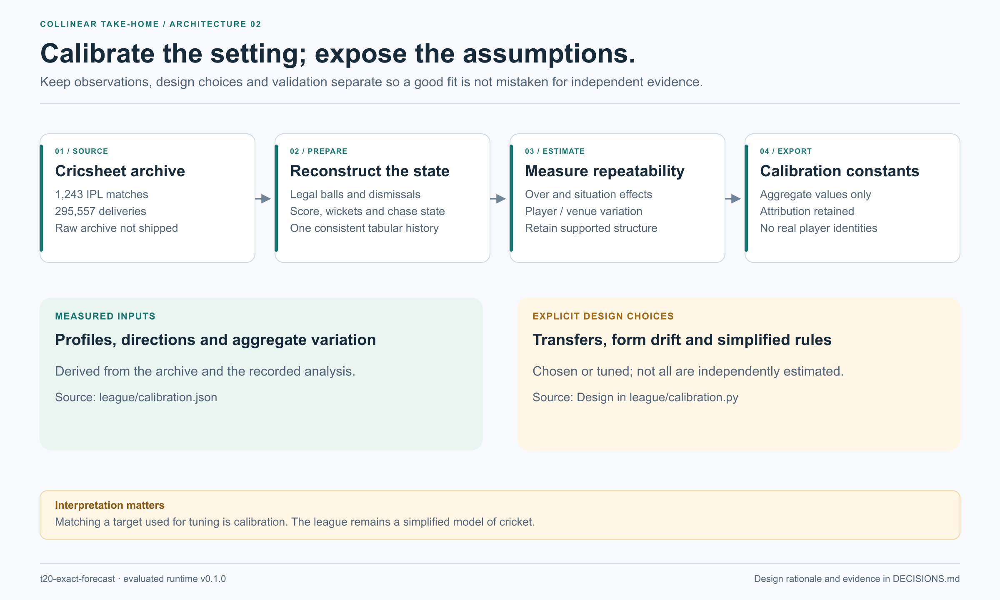
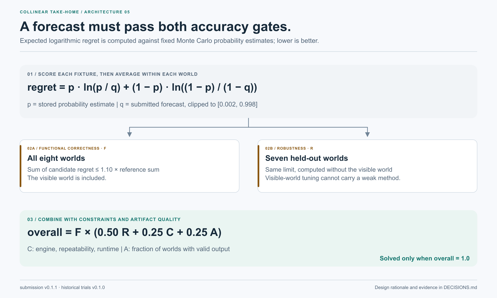
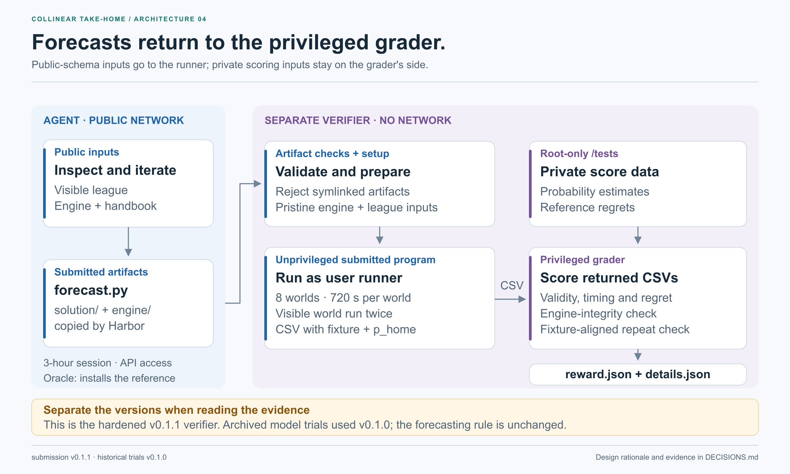

# Learning what to trust

**A Harbor forecasting task for the Collinear take-home**

Siddharth Shashank Kumar · September 2026

Task: `collinear-siddharthshashankkumar/t20-exact-forecast`

## The idea

A player has a good run of matches. How much should that change the forecast for the next one?

That is the question behind this task. An agent gets three seasons of a simulated Twenty20 cricket league, the code that plays its matches, and the next season's fixtures. It must write a program that turns those records into home-win probabilities. The program then runs on seven more leagues whose histories the agent did not inspect during development.

I wanted a task where writing working code was only part of the job. Forecasting also requires deciding what the data can support. A plausible model can overfit short player histories, produce confident probabilities, and pass every format and runtime check. Detecting that mistake takes a useful statistical check, not just a successful execution.

The deliverable is one runnable Harbor task, with an oracle, a programmatic verifier, seed data and model-run evidence. The [full assignment](ASSIGNMENT_BRIEF.md) emphasizes approach, assumptions and ownership as well as the runnable artifacts. Its model-name conflict and my interpretation are recorded explicitly. [DECISIONS.md](DECISIONS.md) explains the alternatives, accepted costs and changes of mind; [ASSUMPTIONS.md](ASSUMPTIONS.md) states what remains uncertain. The design document explains the work; it is not a substitute for the runnable artifacts.

## What the agent actually does

The public league contains ten teams, 180 invented players and 270 historical matches across three seasons. Players change teams and line-ups rotate. The program must use the announced players and the historical evidence, rather than assuming that a team name represents a stable level of ability.

The agent receives:

| Input | Purpose |
|---|---|
| Seven CSV files | Balls, matches, historical line-ups, players, venues, future fixtures and future line-ups |
| `engine/model.py` and `engine/public.json` | The match mechanism and its public constants |
| `engine/league_io.py` | A reader for the supplied files |
| `docs/handbook.md` | File schemas, hidden-effect structure, scoring rule and program constraints |
| `solution/forecast.py` | A starter that predicts 0.5 for every fixture |

Its deliverable has one entrypoint:

```sh
python solution/forecast.py --league <folder> --out <file.csv>
```

The CSV must contain `fixture` and `p_home`, with a finite probability between zero and one for every fixture. The submission can include supporting files under `solution/`. It may import the unchanged engine, NumPy, pandas, SciPy and the standard library.

The handbook requires repeatable output, no network use, and at most 720 seconds per league on two CPU cores. The verifier tests repeatability on the visible league only. Network use is prohibited by the prompt but is not blocked by the frozen verifier configuration; this is a real enforcement limitation.

## Why this work matters

A sports analytics desk needs a repeatable forecast from changing line-ups and uneven player histories. A one-off spreadsheet or a program tuned to a single league is not enough: the next batch of data must go through the same process without hand editing.

The business value is in dependable probabilities and an automated refresh, not in claiming that a synthetic cricket model can price real matches. Similar judgment is needed when forecasting demand for new products or failure rates for equipment with little history. In each case, a small sample can look more informative than it is.

The benchmark is practical to operate because expensive data generation happens once. The stored worlds and probability estimates are reused across trials. The archived oracle's verification took about 4.3 minutes; candidate runtime varies by method and can be much longer. The per-world limit is twelve minutes. This is a bounded computational task, although model sessions and model-review commands still have provider costs.

## Why simulate the league?

A match outcome is a noisy way to grade a probability. A sound 70% forecast should lose about three times in ten. With only a modest number of matches, realized outcomes can obscure the difference between a careful forecast and an overconfident one.

A simulator gives the task author the hidden state and a way to estimate each fixture's underlying probability. The task stores estimates from **100,000 simulations per batting order**, then evaluates expected logarithmic loss against those fixed values. No new match outcome is sampled during grading.

This makes grading deterministic for a deterministic submission. It does **not** make the stored probabilities mathematically exact. They have Monte Carlo error, and the reference forecast has its own simulation uncertainty. “Exact” is retained in the task slug for continuity with the evaluated version; the report states the measurement limits explicitly.

Invented identities also remove a source of leakage. An agent cannot rely on a famous player's reputation: it must work with the supplied records. The held-out worlds use the same mechanism with different generated histories.

## Why cricket, and how realistic is it?

Cricket offers repeated observations of individual players within a clear match structure. Twenty20 bounds a normal innings at 120 legal balls, which makes repeated simulation affordable. The public Cricsheet archive supplied a useful calibration source.

The development pipeline used 1,243 IPL matches and 295,557 deliveries to estimate aggregate patterns. The architecture drawings have been redesigned for this revision, with editable sources and PNG exports. They draw on the repository and the earlier six drawings by Rutvikk Kharod, used with permission; see [figure provenance](PROVENANCE.md#drawings-and-independent-review).



Some constants come directly from the archive. Others are design choices, such as transfer rates, or values tuned to reproduce aggregate behavior. The distinction is recorded in `league/calibration.py` and the working notes.

The existing validation reports a mean first-innings score of 189.2 against an archive target of 188.5, a chase-win rate of 51.0% against 50.9%, and a correlation of 0.977 between the simulated and observed run-rate profiles. The score spread is narrower: 35.0 against 37.4. The tuned aggregates are calibration targets, not independent evidence of realism.

The engine deliberately simplifies the game: five bowlers rotate, the toss winner chases, and tied matches use a coin flip. It omits a separate effect for each batter–bowler pair. Weak repeatability in the calibration analysis motivated that omission; it does not prove that such effects do not exist in real cricket.

The task measures inference within the supplied simulation. It makes no claim about performance on real fixtures.

## Where the difficulty comes from

The steps depend on one another:

1. Read the records and engine correctly.
2. Estimate player and venue effects while accounting for uneven sample sizes.
3. Carry those estimates into forecasts for a later season with different line-ups.
4. Build a check that can expose a mistaken assumption about uncertainty.
5. Package the method so it runs deterministically on unfamiliar league folders.

An early mistake can survive every later engineering check. For example, a solver can validate against synthetic leagues that use the same overly wide distribution of player abilities as its estimator. That experiment may look convincing while testing the wrong assumption.

The engine is public because reverse engineering cricket rules is not the intended difficulty. The handbook describes the kinds of hidden effects, but their values and magnitudes must be inferred. There is enough information for a strong solution, while the uncertainty is large enough that naive estimates perform poorly.

Earlier development explored a backtest audit and an ingest-service task. They are described in the historical decision record and are not submitted. Their separate trial records are not part of this repository, so the submission's failure evidence rests on this forecasting task.

## How the verifier scores a submission

Each of eight worlds has 24 fixtures. For stored probability `p` and submitted probability `q`, the verifier computes:

```text
q = clip(q, 0.002, 0.998)
regret = p * ln(p / q) + (1 - p) * ln((1 - p) / (1 - q))
```

It averages over fixtures within each world and sums the world regrets. The submission must be within **10% of the reference** both across all eight worlds and across the seven held-out worlds alone. A good result on the visible world therefore cannot compensate for poor generalization.

The reference fits the documented ball model with penalized likelihood, selects a shrinkage multiplier by validation, and simulates fixtures with fixed seeds. It uses public files at runtime. Its base prior scales were chosen with knowledge of the generating spreads, which gives its design an advantage over an outside solver. The tolerance does not remove that advantage, and it has not been measured directly.



The verifier writes five fields to `/logs/verifier/reward.json`:

| Field | Meaning |
|---|---|
| `functional_correctness` | All-eight-world regret rule passes |
| `robustness` | Held-out-seven regret rule passes |
| `constraint_satisfaction` | Mean of engine-integrity, visible-world repeatability and runtime checks |
| `artifact_quality` | Fraction of worlds with valid forecasts |
| `overall` | Functional correctness × (0.5 × robustness + 0.25 × constraints + 0.25 × artifact quality) |

Only `overall = 1.0` counts as solved. A failed forecast cannot earn an overall pass through clean formatting.

The scoring rule was committed before the first model pilot. Development comparisons informed it: pooled regret was more stable than a separate threshold for each world. The coin-flip starter, team ratings, unshrunk player estimates and raw head-to-head method all miss the chosen threshold. The “last season only” comparison also misses, but its validation bug limits what can be inferred from that particular baseline.

## Separation and known weaknesses

Harbor runs the agent and verifier in separate containers. The agent image contains the public files only. Harbor transfers the submitted solution and engine copy; the grader hashes the engine against a pristine copy, then runs the submission beside the pristine engine.



In the intended container, submitted code runs as the unprivileged `runner` user and cannot read the private truth files under `/tests`. The grader also checks output validity, timing and repeatability. This is useful isolation, but it is not a proof against adversarial code.

The independent review identified weaknesses in process cleanup after timeout, privilege handling outside the intended root-run container, and undeclared verifier network isolation. The output checks also do not reject every extra-row or fixture-order trick. These limitations remain in the evaluated version and are described in the [run report](RUN_REPORT.md).

The historical linter passed 11 checks. It was a language-model review of the task package, not a trajectory judge and not an exhaustive verifier security audit. Programmatic grading determines all task rewards.

## What happened in the required model trials

Five Claude Opus 4.7 trials used Claude Code, and five GPT-5.5 trials used Codex. The job configurations record high reasoning effort. All ten produced valid forecasts but failed the stored forecasting rule.

| Evidence | Result | Interpretation |
|---|---|---|
| Oracle | Every reward field 1.0 | A submission through the public interface can satisfy the verifier |
| No-op starter | Overall 0.0; valid output and constraints 1.0 | A well-formed 0.5 forecast is insufficient |
| Opus 4.7 | 0/5 passes; regret ratios 1.364–1.703 | Clear misses on these trials |
| GPT-5.5 | 0/5 passes; ratios 1.109–1.575 | One borderline result and one interrupted session are flagged |
| Supplementary models | Fable 5.1: 2/3; GPT-6-astra: 2/2 | Evidence that other agents can solve this version |

The full brief names GPT-5.5-high / Opus 4.7 in its goal and explicit run requirement, and the newer pair in its target-outcome paragraph. I prioritize the repeated goal/run requirement and report the newer pair separately. If the newer-pair outcome is mandatory, this version does not establish a clean failure. That ambiguity is not resolved by relabeling a borderline miss.

The [run report](RUN_REPORT.md) gives every trial identity and the excluded jobs. GPT-5.5 run 2 is a useful starting point: **1.575×** total regret and **1.613×** held-out regret, with all validity and constraint checks satisfied. This is a substantive forecasting miss, well away from the threshold.

## Failure analysis: a working program can still trust noise

Inspection of the first six programs found weak shrinkage: their prior scales allowed player estimates to move too far on limited evidence. Their checks largely established execution, determinism, range or symmetry. One generated its own validation worlds with the same loose priors, so its test reinforced the assumption it needed to question.

One-constant interventions on held-out world c support this diagnosis. For example:

| Submission | As submitted / reference | Intervention | After / reference |
|---|---:|---|---:|
| Opus run 1 | 2.70 | Raise the common ridge penalty from 1 to 25 | 1.36 |
| GPT-5.5 run 2 | 2.55 | Multiply prior standard deviations by 0.33 | 1.57 |
| GPT-5.5 run 6 | 1.42 | Halve prior standard deviations, retaining its output hedge | 0.91 |

These are diagnostic experiments using reviewer knowledge, not revised model submissions. They show that shrinkage choices materially affected the score on this world. They do not prove that the edits would pass all eight worlds. The diagnosis for runs 7–10 relies on forecast resemblance rather than the same intervention evidence.

The lesson I take from these runs is specific: an agent can implement the mechanism correctly while failing to test how strongly its estimates should be trusted.

## Fairness and limits of the conclusion

The prompt supplies schemas, the mechanism, the scoring formula and the constraints. The oracle passes, and independently written model submissions also pass. Those are meaningful solvability checks.

There are also limits that deserve equal visibility:

- **Designer-informed reference.** Its base prior scales use knowledge unavailable to the agent. The frozen handbook understates that advantage. A data-estimated reference would be a cleaner next version.
- **Borderline verdicts.** Development resimulations put pooled reference-regret variation at roughly 1.1% of its mean. GPT-5.5's 1.109 and Fable's 1.104 results are too close to the 1.10 threshold for strong pass/fail conclusions beyond the fixed rule. This rough band is a sensitivity guide, not a calibrated confidence interval for each aggregate.
- **Finite probability estimates.** Stored truth has Monte Carlo error, with some shared random streams across worlds. An independent-stream precision audit remains open.
- **Small samples.** Five trials per required model do not establish that a model always fails. The counts describe these recorded runs.
- **Limited causal analysis.** Interventions cover six programs on one world. They do not establish a universal failure mechanism.
- **Verifier weaknesses.** The evaluated verifier is useful but not fully hardened against hostile submissions.
- **No human baseline.** The estimated expert completion time in the metadata is a design estimate, not an observed human trial.
- **Reproducibility boundaries.** The primary packages and base image are pinned; transitive Python dependencies and historical harness installers are not fully locked. The original calibration archive hash is missing.

AI assistance was used to build and edit the task, as disclosed in [provenance](PROVENANCE.md). Cross-family passes are useful evidence of solvability, but they do not rule out every possible design bias.

## What I would improve next

I would first replace the designer-informed prior scales with a reference that estimates them from data, then measure the new reference's variability on fresh development worlds. I would also harden verifier isolation, align repeatability checks by fixture identity, and audit truth precision with independent random streams.

Those changes would create a new evaluated version. They should receive new oracle and negative-control checks and fresh model trials, rather than inherit the current results.

For this documentation revision, the scoring rule and all 118 runnable task files remain unchanged. Packaging now includes the report and evidence, and the reviewer-facing documents distinguish observations, interpretations and open work. [VALIDATION.md](VALIDATION.md) records the checks.

## Reproduce and inspect

Use the [README](README.md) for commands appropriate to the source checkout or extracted task, and the [run report](RUN_REPORT.md) for exact job identities, reward calculations and failure evidence.

The linked subgoals are inspection, estimation, hypothesis testing and delivery of a reusable program; the [engineering notes](NOTES.md) show what was checked at each boundary. The development code remains organized as follows:

| Source | Responsibility |
|---|---|
| `dev/` | Calibration, data generation, reference comparisons and diagnostic interventions |
| `league/` | Simulation, hidden-world generation and public file I/O |
| `forecasters/` | Reference and comparison methods |
| `scoring/` | Expected-loss calculations |
| `harbor/` | Frozen prompt, metadata, environment, oracle and grader templates |
| `task_src/`, `task_data/` | Public starter/handbook and committed league data |
| `package_task.py` | Assemble the runnable task and reviewer material |
| `jobs/` | Original trial records, including exclusions |

The earlier PDF and full working notes are retained in the source repository as historical design material. Their broader claims and older brief interpretation should be read against this report and the canonical assignment.
