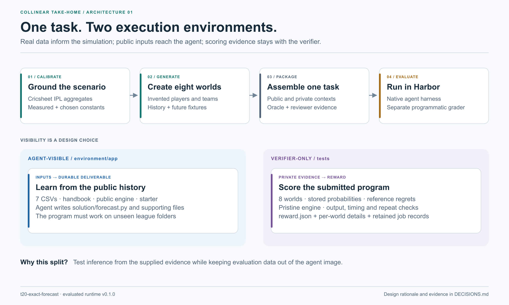

# t20-exact-forecast

**Can an agent tell how much of a player's recent form is real?**

I built this task around a common forecasting mistake: treating a short, noisy record as a reliable estimate of ability. A program can run cleanly and still make that mistake. The task asks an agent to discover it, correct for it, and deliver a forecaster that works on leagues it has never seen.

The setting is a simulated Twenty20 cricket league. The agent gets three seasons of ball-by-ball history, the public match engine, and next season's fixtures and line-ups. It writes `solution/forecast.py`, which returns a home-win probability for each fixture. The verifier evaluates those probabilities across eight leagues against stored estimates generated using the hidden simulation state.

“Exact” in the task name refers to evaluating expected loss against probabilities rather than scoring a single match result. The probabilities themselves are Monte Carlo estimates, not closed-form truth. That distinction matters near the pass threshold.



*Redrawn with Codex assistance from the repository and the earlier architecture by Rutvikk Kharod; [editable sources](figures/README.md) and [provenance](PROVENANCE.md).*

## Current version and historical results

The submitted package is **v0.1.1**. A deeper audit found artifact-boundary defects that documentation alone could not fix. This version rejects symbolic links and unsafe forecast files, validates complete fixture coverage and repeatability by fixture ID, cleans up child processes, and clears stale rewards before grading. The verifier runs with Docker networking disabled.

The prompt now describes Monte Carlo precision and the reference's designer-informed priors accurately. The same five Python distributions are pinned by version and distribution hash. Data, engine, oracle and numerical scoring remain unchanged. The fresh **v0.1.1** oracle passes all components. The first current-version **GPT-5.5-high** attempt fails forecast quality at **1.230×** total / **1.246×** held-out reference regret, while passing artifact and constraint checks, with no infrastructure exception. [VALIDATION.md](VALIDATION.md) contains those results and the archived-program replay.

A separate [eight-trial replication](REPLICATION_REPORT.md) is complete. With two high-effort native-harness attempts each, passes were **GPT-5.5 1/2, Opus 4.7 0/2, GPT-6-astra 2/2 and Fable 5.1 2/2**. All sessions finished normally with no retries. These current-version observations stay separate from the historical table below; they demonstrate a GPT-5.5 solution as well as failures.

[REPLICATION_REPORT.md](REPLICATION_REPORT.md) tracks the subsequent predeclared v0.1.1 batch across both model pairs. Its slot and attempt records keep passes, task failures and operational problems distinguishable. The earlier v0.1.1 attempt above is not pooled into that batch; the table below is the original **v0.1.0** series.

| Model and harness | Graded submissions | Passes | Total regret / reference |
|---|---:|---:|---:|
| Claude Opus 4.7 · Claude Code · high effort | 5 | 0 | 1.364–1.703 |
| GPT-5.5 · Codex · high effort | 5 | 0 | 1.109–1.575 |
| Claude Fable 5.1 · Claude Code · high effort, supplementary | 3 | 2 | 1.008–1.104 |
| GPT-6-astra · Codex · high effort, supplementary | 2 | 2 | 1.054–1.072 |

The pass limit is **1.10×** the reference's regret, applied to all eight worlds and separately to the seven held-out worlds. A complete pass also requires valid output and the constraint checks. The limit was committed before the archived evaluation series; the repository does not independently verify the chronology of earlier prototype work.

The ten required-model submissions all missed the recorded rule. GPT-5.5's 1.109 result is borderline given uncertainty in the reference; a different GPT-5.5 session hit an account limit after writing its program. Excluding that interrupted session leaves 0/4 GPT-5.5 passes. The report accounts for four other excluded jobs, including one where the verifier graded the unchanged starter. These are not counted as substantive model failures.

For the first six submissions, interventions support weak shrinkage as a contributor to error on one held-out world. Several agents had performed real predictive checks: GPT-5.5 run 2 beat a coin flip on 90 historical matches, while runs 4 and 6 compared modeling choices. The failure was more specific than skipped verification: those checks did not resolve the prior choices that hurt the final forecasts. [Read the transcript-based analysis](RUN_REPORT.md#7-failure-analysis).

## Run the packaged task

Prerequisites: Docker with a running daemon, and **Harbor 0.23.0**, the version used for the archived jobs. Model trials also need access through the relevant harness/provider. Oracle and no-op runs do not need model credentials. Harbor's optional `check` command uses a language model and does need access.

From the **Git repository root**:

```sh
cd t20-exact-forecast
harbor run -p ./dist/collinear-siddharthshashankkumar/t20-exact-forecast -a oracle
harbor run -p ./dist/collinear-siddharthshashankkumar/t20-exact-forecast -a nop
harbor run -p ./dist/collinear-siddharthshashankkumar/t20-exact-forecast -a codex -m openai/gpt-5.5 --ak reasoning_effort=high
# Alternatively, use the other model allowed by the brief:
harbor run -p ./dist/collinear-siddharthshashankkumar/t20-exact-forecast -a claude-code -m anthropic/claude-opus-4-7 --ak reasoning_effort=high
harbor view ./jobs
```

Expect `overall = 1.0` for the oracle and `overall = 0.0` for no-op. Inspect each trial's `verifier/reward.json`, `verifier/details.json` and `result.json`; a zero caused by a grader error is not evidence of model failure. Existing data and the packaged task are committed, so no calibration download or data regeneration is needed to run them.

## Rebuild and prepare the handoff

From this directory, with Python 3.12 available:

```sh
make venv PYTHON=python3.12
make package
make audit
make submission
```

`make submission` writes `submission/collinear-siddharthshashankkumar.zip` and a SHA-256 checksum. The archive contains exactly one Harbor task directory, with its documentation, original evidence and validation records. It does not include the `harbor/` development templates as a second task. The package's README has commands for running after extraction.

`make data` is only for regenerating the synthetic data; it is not a prerequisite for reviewing or running this submission. Its cache does not track every input, so a changed simulator needs an intentional fresh data build. Rebuilding the original calibration additionally needs the untracked Cricsheet archive, whose download hash was not recorded.

## Continue the review

1. [Decisions](DECISIONS.md): the reasoning, alternatives and evidence behind the design.
2. [Run report](RUN_REPORT.md): historical trials, failure analysis and current-version boundaries.
3. [Replication](REPLICATION_REPORT.md): the fixed plan, attempt records and results of the separate current-version batch.
4. [Validation](VALIDATION.md): controls, verifier checks and the earlier v0.1.1 model attempt.

[Assumptions](ASSUMPTIONS.md) and [engineering notes](NOTES.md) support the reasoning. [Design](DESIGN_DOCUMENT.md) explains the architecture and economic relevance; [figure sources](figures/README.md) make the diagrams editable; [provenance](PROVENANCE.md) identifies external work and assistance.

The full assignment is reproduced in [ASSIGNMENT_BRIEF.md](ASSIGNMENT_BRIEF.md), including the conflicting model names and my explicit interpretation. Current Markdown documentation takes precedence over the earlier `docs/DESIGN.pdf`, which is retained as a historical design artifact.
