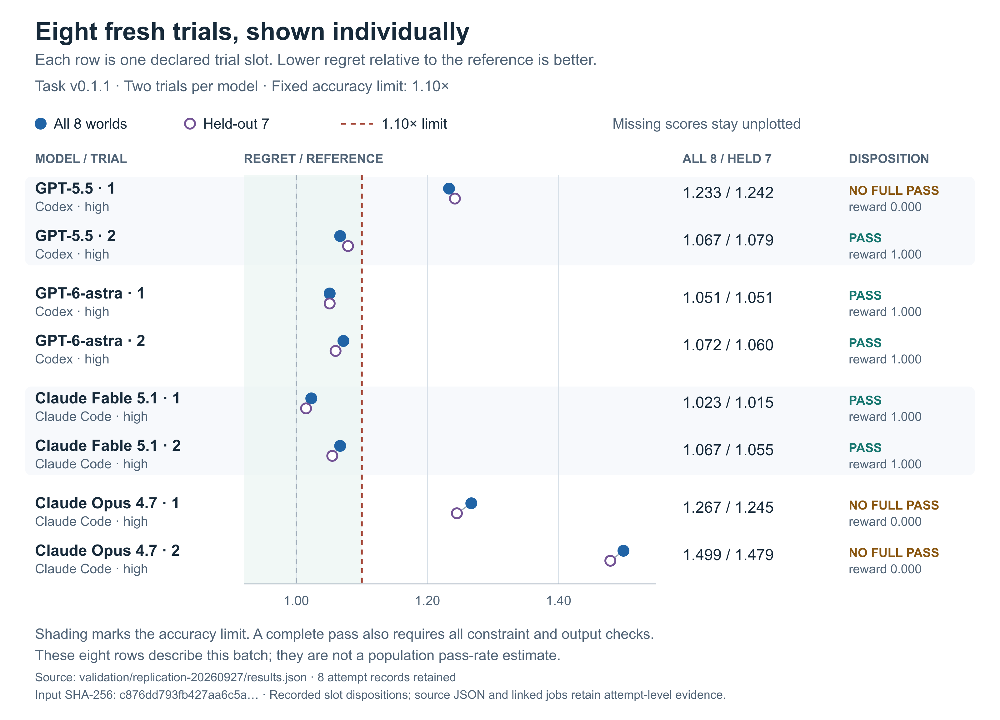

# Current-version replication

**Siddharth Shashank Kumar · t20-exact-forecast v0.1.1**

## Why I ran another batch

The first v0.1.1 GPT-5.5 attempt established a valid forecasting failure after the verifier repairs. It was still one attempt. The older trials used a different prompt and verifier, and the assignment names two different model pairs. I wanted fresh observations of both pairs under the same current task.

I committed a fixed plan for **eight new trials: two each of GPT-5.5, GPT-6-astra, Claude Opus 4.7 and Claude Fable 5.1**, all at high reasoning effort in their native harnesses. The earlier v0.1.1 GPT-5.5 trial remains separate. I chose two per model to get replication across all four models without pretending that this small batch measures a population pass rate. I would not extend the sample only until I found a preferred outcome.

Plan: [predeclared slots and stopping rule](validation/replication-20260927/plan.json), committed in [746a494](https://github.com/siddharthshashank/collinear-siddharthshashankkumar/commit/746a494a1cbbcf93465415a94b625c8703dbffa6) before any batch trial started.

## What stays fixed

The batch uses the task from commit `6092394`, whose 119 runtime files match the v0.1.1 runtime frozen in `e83f997`. There are no new task hints, follow-up prompts, changed worlds, threshold adjustments or oracle changes. The 1.10 reference-regret limit applies both to all eight worlds and to the seven held-out worlds.

Each trial receives the existing three-hour agent budget, three-hour verifier budget, two CPUs and 4 GB memory. Up to three trials run concurrently on a Docker host with 16 CPUs and approximately 15.6 GiB RAM. That leaves memory and CPU headroom, but it does not make this a controlled latency comparison. The program still has 720 seconds per world.

Native harness versions are pinned: **Codex 0.157.1** and **Claude Code 2.1.274**. The model identifiers and explicit high-effort arguments are in every trial configuration. Model backend revisions and actual reasoning compute are not controlled by the task.

### A package-hash correction, with no runtime change

The predeclared plan copied the Harbor digest from the earlier controls. Harbor includes the reviewer `README.md` in that digest, even though the agent image does not include it. The finalized README in the frozen `6092394` snapshot therefore produces a different package digest.

The [snapshot binding](validation/replication-20260927/snapshot-binding.json) records all 120 files Harbor hashes. Replacing only its README hash with the earlier README hash reproduces the prior digest exactly. All **119 runtime files are unchanged**. The original plan is retained without rewriting its expected digest; the correction is a separate record, made while the initial trials were running. No task input was changed to obtain a different result.

## Results

All **eight trials completed normally** on 27 September 2026. There were **five passes and three forecasting failures**, with no retries, account interruptions, exhausted budgets or infrastructure exceptions. Every submission received **1.0 for artifact quality and constraint satisfaction**. The three failures missed both accuracy gates; their functional, robustness and overall rewards were 0.0. Passing submissions received 1.0 on all five components.

| Model and replicate | All-world regret / reference | Held-out regret / reference | Verdict |
|---|---:|---:|---|
| [GPT-5.5 · 1](validation/jobs/replication-20260927-gpt55-r1/) | 1.233 | 1.242 | Forecasting failure |
| [GPT-5.5 · 2](validation/jobs/replication-20260927-gpt55-r2/) | 1.067 | 1.079 | Pass |
| [GPT-6-astra · 1](validation/jobs/replication-20260927-astra-r1/) | 1.051 | 1.051 | Pass |
| [GPT-6-astra · 2](validation/jobs/replication-20260927-astra-r2/) | 1.072 | 1.060 | Pass |
| [Fable 5.1 · 1](validation/jobs/replication-20260927-fable-r1/) | 1.023 | 1.015 | Pass |
| [Fable 5.1 · 2](validation/jobs/replication-20260927-fable-r2/) | 1.067 | 1.055 | Pass |
| [Opus 4.7 · 1](validation/jobs/replication-20260927-opus-r1/) | 1.267 | 1.245 | Forecasting failure |
| [Opus 4.7 · 2](validation/jobs/replication-20260927-opus-r2/) | 1.499 | 1.479 | Forecasting failure |

The limit is **1.10 on both ratios**. Ratios above are rounded to three decimals; archived verifier details retain the underlying scoring record. In this batch, GPT-5.5 passed **1/2**, Opus **0/2**, Astra **2/2**, and Fable **2/2**. These are observed counts, not population pass-rate estimates.



The [machine-readable results](validation/replication-20260927/results.json) retain all eight slots, rewards, world scores, native completion evidence, timings, token usage and source hashes. The [evidence audit](validation/replication-20260927/audit.json) covers the complete batch. The eight launcher records all report zero matches for the supplied credential in finalized job evidence.

The batch ran from **09:01:40 to 11:17:21 UTC**, approximately **2 hours 16 minutes** with up to three concurrent jobs. Agent execution ranged from **8 minutes 37 seconds to 84 minutes 2 seconds**. Equal nominal budgets did not produce equal reasoning compute, token usage or elapsed time, so this is not a controlled speed or efficiency comparison.

### What the replication changed

The reruns were worthwhile. They supplied fresh evidence under the corrected contract and overturned any implication that GPT-5.5 invariably fails this task. The first replicate failed and the second passed. Both Opus submissions failed by clear fixed-rule margins. Astra and Fable each passed twice, strengthening solvability while leaving the brief's stricter newer-pair failure requirement unmet.

The successful programs also used different approaches. Astra learned variance scales during execution, Fable's second program fixed scales estimated during development, and GPT-5.5's passing program combined point estimation, recency weighting and probability shrinkage. The observations do not establish that one of those choices caused success. I stopped at the declared eight trials; the next useful investment is stronger measurement of the reference and simulation uncertainty, not an open-ended search for a preferred verdict.

## What the completed attempts show

### Astra, first replicate

Astra passed every reward component, with **1.051×** regret on both the all-world and held-out gates. I take that as evidence that the revised task remains solvable through the agent interface. One pass does not predict the next replicate.

Its program learns variance components, tracks half-season player form, and integrates uncertainty through a joint Laplace approximation and simulation. The recorded checks include exact agreement with the public simulator on one fixture when posterior uncertainty is disabled, repeated identical output, and a full interface check. Its third-season diagnostic reuses nuisance conditions fitted on all seasons: it is a conditional player-effect generalization check, not a fully out-of-sample match forecast evaluation. The final message explicitly leaves hidden performance unverified.

Evidence: [reward](validation/jobs/replication-20260927-astra-r1/task__yKvhvAB/verifier/reward.json), [world scores](validation/jobs/replication-20260927-astra-r1/task__yKvhvAB/verifier/details.json), [submitted program](validation/jobs/replication-20260927-astra-r1/task__yKvhvAB/artifacts/app/solution/forecast.py), and [recorded checks](validation/jobs/replication-20260927-astra-r1/task__yKvhvAB/agent/codex.txt#L35), including the [conditional diagnostic](validation/jobs/replication-20260927-astra-r1/task__yKvhvAB/agent/codex.txt#L43).

### Astra, second replicate

The second independent program also passed every component: **1.072×** total and **1.060×** held-out regret. It combined hierarchical empirical Bayes, correlated within-season form and approximate posterior sampling. It checked a likelihood gradient, agreement with both innings types, reduced-copy repeatability and identical-team symmetry, then completed its final public run in **210.3 seconds**.

Its season-three diagnostic fitted match-day adjustments and scaling factors using that season's outcomes, so I treat it as conditional ball-level evidence. The hidden-world pass comes from the independent verifier, not that diagnostic. Together, these two programs show a workable route that estimates variance scales from public history; they strengthen the solvability argument without establishing a general pass rate.

Evidence: [reward](validation/jobs/replication-20260927-astra-r2/task__NdS9y3D/verifier/reward.json), [world scores](validation/jobs/replication-20260927-astra-r2/task__NdS9y3D/verifier/details.json), [submitted program](validation/jobs/replication-20260927-astra-r2/task__NdS9y3D/artifacts/app/solution/forecast.py), [mechanics and gradient checks](validation/jobs/replication-20260927-astra-r2/task__NdS9y3D/agent/codex.txt#L45), and [conditional diagnostic](validation/jobs/replication-20260927-astra-r2/task__NdS9y3D/agent/codex.txt#L33).

### Opus, first replicate

Opus finished normally with a valid, repeatable program, but failed both forecast gates: **1.267×** total and **1.245×** held-out reference regret. Artifact quality and constraint satisfaction were both **1.0**. This is a forecasting failure under the unchanged rule, with a larger gap than the historical borderline misses.

It fitted player and condition effects by coordinate-Newton MAP estimation, then simulated matches with the public engine. It caught a numerical defect in its own updates and fixed it. Although it considered learning prior scales, the final program retained a fixed precision dictionary and pooled player effects across seasons; only era had a season index. Those are inspectable modeling choices, not proven causes of this score.

The more revealing gap is in what its tests established. Five self-generated worlds showed improvement over coin flip, but used fixed skills across seasons, stable squads and assumed scales. They did not evaluate the task's reference. The broader scale-sensitivity tests did not finish. I would therefore narrow its final claim of competitiveness with the reference: the evidence supported its own synthetic checks, while the verifier subsequently rejected its forecast quality. It did check valid output, reduced-simulation repeatability, runtime and invocation from another directory. Calling this a failure to test anything would miss the actual lesson about choosing tests that transfer to the target distribution.

Evidence: [reward](validation/jobs/replication-20260927-opus-r1/task__5M64xsc/verifier/reward.json), [world scores](validation/jobs/replication-20260927-opus-r1/task__5M64xsc/verifier/details.json), [fixed priors in the final program](validation/jobs/replication-20260927-opus-r1/task__5M64xsc/artifacts/app/solution/forecast.py#L226), [synthetic results](validation/jobs/replication-20260927-opus-r1/task__5M64xsc/agent/claude-code.txt#L529), and [final claims](validation/jobs/replication-20260927-opus-r1/task__5M64xsc/agent/claude-code.txt#L709).

### Opus, second replicate

Opus's second replicate completed normally and failed both accuracy gates: **1.499×** total and **1.479×** held-out reference regret. Artifact quality and constraints both scored **1.0**; the [reward](validation/jobs/replication-20260927-opus-r2/task__GQqqirW/verifier/reward.json) and [world scores](validation/jobs/replication-20260927-opus-r2/task__GQqqirW/verifier/details.json) show a forecasting failure with no infrastructure exception.

Its program uses block-coordinate Newton fitting and the public match simulator. Prior variances are fixed, explicitly described in the source as informed guesses. Player effects are pooled across seasons with equal weight; only era varies by season. The forecast extrapolates era and estimates match-day spread from the standard deviation of shrunken fitted day effects. It does not integrate parameter uncertainty.

The agent repaired a substantial numerical instability. Damping alone did not fix the fit; refreshing probabilities between condition groups did, after which the visible training likelihood stabilized. It compared simulation counts, checked fitting stability, and reproduced identical output at reduced settings. Its final default public run completed in **28.826 seconds**, producing 24 matching unique fixture IDs and valid probabilities. I do not treat the earlier divergence as a defect that remained in the delivered program.

Verification concentrated on numerical behavior and output correctness. I found no historical holdout, synthetic known-truth experiment or reference comparison. An announced recency experiment only inspected season counts, and the final fit remains unweighted. Its final claim of roughly 29 seconds on each of eight leagues exceeds the development evidence, which timed the visible league only. The guessed priors, pooled player effects and omitted uncertainty are inspectable limitations; no intervention establishes how much each affects forecast quality.

Evidence: [fixed prior assumptions](validation/jobs/replication-20260927-opus-r2/task__GQqqirW/artifacts/app/solution/forecast.py#L111), [forecast construction](validation/jobs/replication-20260927-opus-r2/task__GQqqirW/artifacts/app/solution/forecast.py#L258), [numerical repair](validation/jobs/replication-20260927-opus-r2/task__GQqqirW/agent/claude-code.txt#L362), [simulation comparison](validation/jobs/replication-20260927-opus-r2/task__GQqqirW/agent/claude-code.txt#L439), [reduced-setting repeat](validation/jobs/replication-20260927-opus-r2/task__GQqqirW/agent/claude-code.txt#L508), [final public run](validation/jobs/replication-20260927-opus-r2/task__GQqqirW/agent/claude-code.txt#L563), and [final claims](validation/jobs/replication-20260927-opus-r2/task__GQqqirW/agent/claude-code.txt#L564).

### Fable, first replicate

Fable's first replicate passed all five components: **1.023×** total and **1.015×** held-out reference regret, recorded in its [reward](validation/jobs/replication-20260927-fable-r1/task__gZoWu3L/verifier/reward.json) and [world scores](validation/jobs/replication-20260927-fable-r1/task__gZoWu3L/verifier/details.json). The submitted program learns prior scales and form correlations through empirical Bayes, fits a joint Laplace approximation, and simulates 960 antithetic parameter draws with 50 paths per draw for each batting order. I recorded the following implementation findings before receiving the verdict; the pass remains a pass.

The agent did substantial verification. Its optimized Hessian and covariance calculations agreed with separate calculations, it compared forecasts on seven self-generated worlds, and an earlier pair of public runs produced identical output. After the final changes, its public run completed in **195.442 seconds** with 24 valid fixture rows. Its known-scale synthetic comparator uses the same forecasting implementation, so the reported near-parity with that comparator does not establish performance against this task's informed reference. Its final claim of "40 fixed iterations for determinism" also overstates the code: the delivered EM loop retains a 360-second time budget that can stop fitting early.

I found a specific card-construction error: batting split, hand/style and pitch/style effects select the batting team's own bowlers' styles, while the innings uses the opponent's bowling coefficients. The [reproducible diagnostic](VALIDATION.md#a-check-of-fables-first-submitted-card-builder) executes only three reviewed, source-hash-bound card methods on constructed inputs. Its [record](validation/replication-20260927/fable-r1-matchup-audit.json) shows **six mismatches and six passing equal-style controls**. Opposing bowling-style vectors differ in **185 of 192 shipped fixtures**, including 162 of 168 held-out fixtures. This establishes reachable incorrect feature selection. It does not measure the error's contribution to regret or overturn the task pass. Comparing two versions of the same forecaster with different prior scales could miss this shared defect.

There was also a resource-management problem during development. At 09:44:50 UTC, a [bounded container observation](validation/replication-20260927/resource-observation-fable-r1.json) recorded four OOM process kills under the 4 GiB limit while the agent ran parallel self-tests. That is a count at one observation time, not a final trial total. The agent recognized the problem, retried jobs and bounded its Hessian's temporary allocations. Its later completed public run is separate evidence of recovery; I do not treat the earlier process kills as the final outcome.

Evidence: [final forecasting configuration](validation/jobs/replication-20260927-fable-r1/task__gZoWu3L/artifacts/app/solution/forecast.py#L27), [card construction](validation/jobs/replication-20260927-fable-r1/task__gZoWu3L/artifacts/app/solution/spec.py#L136), [innings call sites](validation/jobs/replication-20260927-fable-r1/task__gZoWu3L/artifacts/app/solution/simulate.py#L55), [EM stopping conditions](validation/jobs/replication-20260927-fable-r1/task__gZoWu3L/artifacts/app/solution/hyper.py#L74), [numerical checks](validation/jobs/replication-20260927-fable-r1/task__gZoWu3L/agent/claude-code.txt#L882), [final public run](validation/jobs/replication-20260927-fable-r1/task__gZoWu3L/agent/claude-code.txt#L1386), and [final claims](validation/jobs/replication-20260927-fable-r1/task__gZoWu3L/agent/claude-code.txt#L1387).

### Fable, second replicate

Fable's second replicate passed all five components: **1.067×** total and **1.055×** held-out reference regret. This program estimates prior scales offline from the supplied league and keeps them fixed during evaluation. It fits seasonal player effects with Newton's method, samples a joint Laplace approximation, projects quality forward, and simulates 25,000 paths per batting order using 1,000 parameter draws. The final program uses a shared batting/bowling form correlation of 0.716 and omits within-season drift. Although its fitting library includes an EM helper, the submitted entrypoint does not call it.

Its opponent wiring is correct: batting effects and bowling coefficients use the same opposing bowlers. The agent also checked the combined card builder and simulator against known hidden states from its own generator on eight fixtures. The differences were consistent with its estimated Monte Carlo error; this was a statistical comparison, not exact trajectory equality. Its final public run returned normally in **60.5 seconds**, with all 24 fixture IDs and finite probabilities, and a repeat from another working directory produced byte-identical output.

The seven self-generated leagues are useful development evidence. Their summed regret was approximately 0.0764, compared with 0.0762 when the same estimator used known synthetic scales; one world was slightly worse than coin flip. I would not infer parity with the assignment's reference from that comparison or from a similar ratio to coin flip. The learned scales come from one visible league, future era uncertainty is omitted, and the agent's own diagnostics show that the talent/form decomposition is weakly constrained by these data. The independent [reward](validation/jobs/replication-20260927-fable-r2/task__8YZFvqv/verifier/reward.json) and [world scores](validation/jobs/replication-20260927-fable-r2/task__8YZFvqv/verifier/details.json) establish that this program passed despite those limitations.

Evidence: [submitted entrypoint](validation/jobs/replication-20260927-fable-r2/task__8YZFvqv/artifacts/app/solution/forecast.py#L33), [fixed priors](validation/jobs/replication-20260927-fable-r2/task__8YZFvqv/artifacts/app/solution/hyper.py#L5), [opponent selection](validation/jobs/replication-20260927-fable-r2/task__8YZFvqv/artifacts/app/solution/forecastlib.py#L54), [synthetic simulator comparison](validation/jobs/replication-20260927-fable-r2/task__8YZFvqv/agent/claude-code.txt#L629) and [its results](validation/jobs/replication-20260927-fable-r2/task__8YZFvqv/agent/claude-code.txt#L647), [seven-world results](validation/jobs/replication-20260927-fable-r2/task__8YZFvqv/agent/claude-code.txt#L1018), [final runtime and format check](validation/jobs/replication-20260927-fable-r2/task__8YZFvqv/agent/claude-code.txt#L1104), [repeat check](validation/jobs/replication-20260927-fable-r2/task__8YZFvqv/agent/claude-code.txt#L1119), and [final claims](validation/jobs/replication-20260927-fable-r2/task__8YZFvqv/agent/claude-code.txt#L1120).

### GPT-5.5, first replicate

GPT-5.5's first replicate finished normally and failed both accuracy gates: **1.233×** total and **1.242×** held-out reference regret. Constraints and artifact quality both scored **1.0**. The [reward](validation/jobs/replication-20260927-gpt55-r1/task__Z9uA3EF/verifier/reward.json) and [world scores](validation/jobs/replication-20260927-gpt55-r1/task__Z9uA3EF/verifier/details.json) record a forecasting failure, with no infrastructure exception.

GPT-5.5 delivered a three-member ensemble of regularized point estimates, averaging probabilities from the public match simulator. Its prior scales, recency weights, shrinkage factors and ensemble weights are fixed. Player effects are pooled across seasons with older observations downweighted; the program omits fitted match-day and batter–venue effects. Reusing the public simulator preserves its opponent selection and innings mechanics.

The agent inspected player observation counts, added role/style baselines, and saw a prototype optimizer converge. Its final program compiled and completed a public run with 24 matching unique fixture IDs and finite probabilities. It announced a historical backtest, but the next executed cell explicitly skipped full cross-validation to save time. I found no completed predictive backtest, synthetic known-truth comparison or repeatability check for the delivered program. That is a narrower validation record than the earlier GPT-5.5 attempts, which did run predictive backtests.

The final response accurately lists execution, compilation and output checks without claiming hidden success. Its roughly 90-second runtime is agent-reported; the preserved development output does not measure that duration. The independent verifier later completed all eight initial world runs and the repeat within the time limit. The fixed modeling choices are inspectable limitations, not a demonstrated causal explanation of this score.

Evidence: [final ensemble and settings](validation/jobs/replication-20260927-gpt55-r1/task__Z9uA3EF/artifacts/app/solution/forecast.py#L274), [announced backtest](validation/jobs/replication-20260927-gpt55-r1/task__Z9uA3EF/agent/codex.txt#L40), [explicit skip](validation/jobs/replication-20260927-gpt55-r1/task__Z9uA3EF/agent/codex.txt#L42), [public output check](validation/jobs/replication-20260927-gpt55-r1/task__Z9uA3EF/agent/codex.txt#L63), and [final response](validation/jobs/replication-20260927-gpt55-r1/task__Z9uA3EF/agent/codex.txt#L76).

### GPT-5.5, second replicate

GPT-5.5's second replicate passed all five components: **1.067×** total and **1.079×** held-out reference regret, recorded in its [reward](validation/jobs/replication-20260927-gpt55-r2/task__aJVVf4j/verifier/reward.json) and [world scores](validation/jobs/replication-20260927-gpt55-r2/task__aJVVf4j/verifier/details.json). That makes GPT-5.5 **one pass in two trials in this batch**. The earlier single v0.1.1 failure is separate.

The second GPT-5.5 program fits one regularized point estimate, uses the public engine for 20,000 simulations per batting order, and shrinks probabilities toward 0.5 by a fixed factor of 0.82. Its prior scales and match-day spread are fixed. Player quality is pooled across seasons with recency weights; it omits an explicit form transition, future parameter uncertainty and batter–venue affinity. This is a successful solution route without runtime prior-scale learning or full posterior integration.

This agent completed a genuine forward check. It fitted seasons zero and one, forecast all 90 matches in season two, and compared the forecasts with observed winners. Recency weighting achieved log loss **0.683757**, versus **0.688818** for equal weighting and **0.693147** for coin flip. The held-out outcomes and nuisance adjustments were not used to fit the forecasting model. That is stronger predictive evidence than the first replicate's skipped backtest.

The same small season was then reused to compare variants and tune shrinkage. Its best shrinkage probe was approximately 0.6546; the final 0.82 was a later heuristic choice after fitting all three seasons. The check does not measure hidden probability regret or performance against the informed reference. The delivered program also compiled, produced valid output and completed a byte-identical full repeat. Its final response limits its claims to those checks rather than claiming hidden success.

Evidence: [final program](validation/jobs/replication-20260927-gpt55-r2/task__aJVVf4j/artifacts/app/solution/forecast.py#L204), [forward check and results](validation/jobs/replication-20260927-gpt55-r2/task__aJVVf4j/agent/codex.txt#L47), [shrinkage comparison](validation/jobs/replication-20260927-gpt55-r2/task__aJVVf4j/agent/codex.txt#L53), [public output](validation/jobs/replication-20260927-gpt55-r2/task__aJVVf4j/agent/codex.txt#L62), [full repeat](validation/jobs/replication-20260927-gpt55-r2/task__aJVVf4j/agent/codex.txt#L68), and [final response](validation/jobs/replication-20260927-gpt55-r2/task__aJVVf4j/agent/codex.txt#L85).

## How I interpret the evidence

A full pass requires all reward components to equal 1. A forecasting failure requires a completed normal session, valid output and satisfied constraints, with a failed regret gate. A bad artifact or constraint violation is a different task failure. Account limits, harness errors and operator interruptions are reported separately; a score on an operationally interrupted artifact does not establish what the model would have delivered with its full budget.

Operational retries retain the original attempt and identify the same planned slot. The first normal completion or exhausted-budget outcome fixes the slot's model attempt; no later model attempt replaces it, and every attempt remains inspectable.

Exhausting the declared agent budget is also an outcome of the fixed-budget experiment. It is labeled separately from a normal completion and from a provider interruption; it does not justify another attempt just to obtain a finished answer.

Two trials per model can show whether a result repeats and whether a solution route is available. They cannot establish a reliable ranking, a stable population pass rate, or a causal explanation for a score. Near-threshold verdicts remain subject to the statistical limitations explained in [the run report](RUN_REPORT.md#2-the-rule-behind-every-verdict). Passing the task and spending less wall-clock time are different observations.

## Reproduce

From the source checkout's `t20-exact-forecast/` directory, these commands run two attempts per model, sequentially within each job. New jobs are separate from the committed evidence:

```sh
harbor run -p ./dist/collinear-siddharthshashankkumar/t20-exact-forecast -a codex -m openai/gpt-5.5 --ak reasoning_effort=high --ak version=0.157.1 --n-attempts 2 --n-concurrent 1
harbor run -p ./dist/collinear-siddharthshashankkumar/t20-exact-forecast -a codex -m openai/gpt-6-astra --ak reasoning_effort=high --ak version=0.157.1 --n-attempts 2 --n-concurrent 1
harbor run -p ./dist/collinear-siddharthshashankkumar/t20-exact-forecast -a claude-code -m anthropic/claude-opus-4-7 --ak reasoning_effort=high --ak version=2.1.274 --n-attempts 2 --n-concurrent 1
harbor run -p ./dist/collinear-siddharthshashankkumar/t20-exact-forecast -a claude-code -m anthropic/claude-fable-5-1 --ak reasoning_effort=high --ak version=2.1.274 --n-attempts 2 --n-concurrent 1
harbor view ./jobs
```

These commands use the current reviewer package with the same 119 runtime files. To reproduce the archived Harbor package digest as well, use the packaged task directory from [commit 6092394](https://github.com/siddharthshashank/collinear-siddharthshashankkumar/tree/60923946d060714f2b7cc941c08a972570f5d033/t20-exact-forecast/dist/collinear-siddharthshashankkumar/t20-exact-forecast) without regenerating its reviewer README.

Configure access through each native harness. The supplied credential is not part of the task or its documentation. The source-level batch launcher reads credentials from private files, records each declared job separately, and checks finalized evidence for the supplied token before publication. Reported model costs, where available, are harness estimates rather than account billing receipts.
