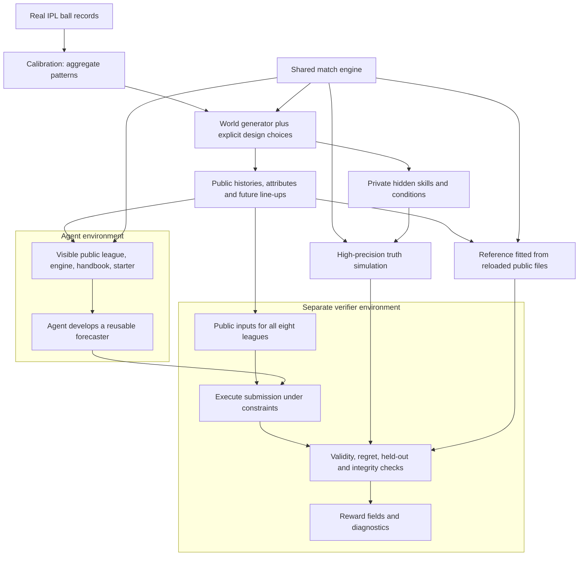

# Learning what to trust

## An IPL-inspired forecasting task for evaluating long-horizon AI agents

**Author:** Siddharth Shashank Kumar  
**Task:** `collinear-siddharthshashankkumar/t20-exact-forecast`  
**Submission:** Collinear take-home assignment · Markdown design document

### The design in one minute

I built a task that asks an AI agent to learn from noisy observations, decide how much to trust what it has learned, and deliver a forecasting program that works on unfamiliar data.

The setting is an invented Twenty20 cricket league calibrated from real IPL ball records. The agent receives three seasons of history, future fixtures and line-ups, and the match simulator. Player abilities and some conditions are hidden. Its job is to estimate each home team's chance of winning.

My central choice is to **publish the mechanism while retaining the hidden quantities that generated the observations**. I can then check forecasts against high-precision estimates of the simulator's actual win probabilities. One unexpected match result cannot make a poor forecast look good. The difficulty is statistical judgment and verification, supported by a working program.

The development experiments changed the design. A larger backtest-repair task remained easy for the tested target models. Too little simulated history left even the comparison methods unable to beat a coin flip. A pass rule applied to every world separately could not provide both the simulation-noise margin and the method separation I wanted. I changed each of those choices before the forecasting pilots.

The pilots produced ten failures from GPT-5.5 and Claude Opus 4.7, then four passes among five completed newer-model runs: GPT-6-astra passed two of two; Claude Fable 5.1 passed two of three. The Fable miss was narrow. These results support an informative task and a recurring earlier failure mode; they do not support claiming that the task consistently defeats the newer models.

This document explains the task, its decisions and the evidence. [DECISIONS.md](DECISIONS.md) gives the decision history; [RUN_REPORT.md](RUN_REPORT.md) preserves results, qualifications and reproduction commands; [PROVENANCE.md](PROVENANCE.md) identifies sources and evidence boundaries. Every number in these documents is in the repository: the job records under `jobs/`, the logs, and the git history.

## 1. What capability am I trying to measure?

A forecasting system can be technically correct and statistically wrong. It may read every file, optimise the intended equation, generate probabilities and finish on time, yet trust an unreliable pattern too much.

That distinction is the subject of this benchmark. The agent must connect four kinds of work:

1. Understand what the records mean and how the system produces them.
2. Estimate quantities that are obscured by noise and changing conditions.
3. Check whether its modelling assumptions are supported by the available history.
4. Turn the resulting method into a repeatable program that generalises to unseen leagues.

The question is not whether an agent knows cricket trivia. It is whether it can recognise that a player with a remarkable short history may be less exceptional than the raw numbers suggest—and design a check capable of exposing that mistake in its own model.

### Why IPL?

IPL data gives this problem a useful combination of detail, uncertainty and understandable outcomes. Ball records show the players, match situation and individual outcome. Players appear repeatedly, but a season still contains limited evidence about each one. A T20 innings has at most 120 legal balls, making repeated simulation practical. A probability of winning is also easier to explain than an abstract synthetic target.

The archive analysis estimated full-season reliability at about **0.46 for batting scoring rate and 0.27 for bowling economy**. Reliability here describes how much variation in those measured rates behaves like repeatable signal under the analysis assumptions. It does not mean a fixed share of every player's performance is luck. The practical consequence is that extreme estimates from limited observations should usually move toward an average: *shrinkage*.

I use the archive to calibrate patterns, then invent the identities and histories. Knowing a famous player's reputation cannot reveal an invented player's hidden ability. This preserves a realistic inference problem while giving the evaluator control over its answers.

### Why this is economically relevant

The same decision arises when an analyst estimates a product's conversion rate, a component's failure rate or a location's demand from a small sample. Overreacting to noisy extremes can lead to bad allocation decisions even when the data pipeline works correctly. This task exercises that reasoning in a setting where errors are observable and repeatable.

The economic connection is a motivation, not a measured transfer result. I have not demonstrated that passing this task improves a production forecasting system or predicts a particular financial return.

### What is new

The task combines a calibrated synthetic league, a public simulator, hidden skills, a reusable forecasting interface, a ladder of comparison methods and a frozen probabilistic evaluation. The new artifact is this particular scenario and evaluation design. It is not a claim to have invented cricket simulation, probability scoring or regularisation, and it is not presented as a port of a public benchmark or competition. External sources and the project's use of assistance are recorded in [PROVENANCE.md](PROVENANCE.md).

## 2. Why I chose this over the other designs

| Candidate | What it tested | Evidence or judgment | What I decided |
|---|---|---|---|
| Revision-aware backtest repair | Stop a forecast from using data revisions that were unavailable at its issue date | Opus 4.7 pilots passed versions with 8, 24 and 48 scripts; GPT-5.5 passed the 24- and 48-script versions | Stop adding files to the same challenge |
| Exactly-once ingestion under a declared fault model | Preserve whole-batch visibility across crashes and interleavings | Reference passed 27,710 schedules; five planted defects were caught. No model pilot was run | Park it because I judged the compact repair-and-test loop unlikely to meet the difficulty goal |
| Synthetic probabilistic forecasting | Infer hidden quantities from noisy records and validate uncertain estimates | Comparison methods separated, an executable oracle passed, and model pilots produced informative successes and failures | Develop this task |

The backtest idea came from my work with revised surveillance data. Its failure as a candidate was useful: scaling a documented rule across more files increased workload without exposing the desired failure in those models. That does not imply that all explicit-rule tasks are easy. It meant this version had reached the wrong kind of difficulty.

The forecasting idea offered a different relationship between construction and solution. Generating observations from known abilities is straightforward; recovering those abilities from limited observations is difficult. The evaluator retains an answer that the agent has to infer. That is the core creative insight.

I also considered live sports, market prediction and competition-style tasks. They were less suitable here because of delayed outcomes, noisy short evaluation windows, attribution difficulties, or the brief's prohibition on direct ports. Those are reasons for this choice, not blanket judgments that such tasks cannot be evaluated fairly.

## 3. The task an agent receives

The durable deliverable is `/app/solution/forecast.py`, invoked as:

```text
python solution/forecast.py --league <folder> --out <file.csv>
```

It must write the required fixture identifiers and a finite `p_home` probability between zero and one. The same program is evaluated on the visible league and seven unseen leagues generated by the same process. The agent may choose its own statistical method.

| Public artifact | Purpose |
|---|---|
| `balls.csv` | Observed outcomes and the situation before each legal ball |
| `matches.csv` | Match dates within the synthetic seasons, teams, totals and results |
| `lineups.csv` | Players and batting/bowling positions in historical matches |
| `players.csv`, `venues.csv` | Public attributes of the invented players and grounds |
| `fixtures.csv`, `fixture_lineups.csv` | The matches to forecast and their announced line-ups |
| `/app/engine/` | The simulator, public constants and file reader |
| `/app/docs/handbook.md` | Hidden-variable structure, schemas, grading rule and constraints |
| Starter forecaster | A working program that writes 0.5 for every fixture |

The agent is told that players have style, quality and changing form; venues and match conditions also matter. Their hidden values and population scales are not supplied. The handbook explicitly says that no hidden effect belongs to one specific batter–bowler pair. It also permits agents to simulate their own leagues and check forecasts against truth they construct.

Everything needed by the submitted program must be under `/app/solution/`, apart from the supplied engine and allowed libraries. The engine must remain unchanged. Forecast execution must be deterministic and use no network. Each league invocation has 720 seconds on two CPU cores. The agent session has a separate three-hour budget. A review copy of the solver-facing brief is in [instruction.md](instruction.md); it contains no private answers or reference prior values.

### Why this clears the long-horizon bar

| Subgoal | A meaningful hypothesis or choice | Verification opportunity | Dependency |
|---|---|---|---|
| Inspect and reconstruct the data | Does a record describe the situation before or after a ball? Are player and fixture joins correct? | Check counts, state transitions and small examples | An incorrect state contaminates the entire fit |
| Estimate hidden abilities and conditions | How much should limited player evidence be trusted? | Compare shrinkage choices using appropriately separated history | Overfitting becomes overconfident match probabilities |
| Validate the model | Do generated check leagues resemble the observed league? Does a held-out season support the assumptions? | Compare fitted distributions and held-out predictive performance | A self-check can endorse a wrong model if it assumes the same error |
| Simulate and deliver | How should parameter uncertainty, future conditions and computation be handled? | Runtime, reproducibility, symmetry and probability checks | A useful estimate still has to become a reliable executable artifact |

No one small file supplies the hidden abilities or the answer probabilities. The work includes inspection, hypothesis formation, implementation, state tracking and iteration. A short successful solution remains a success: elapsed time is not itself the capability being measured.

## 4. Architecture: one mechanism, two information sets



**Reading the diagram:** real data sets the broad scale of the invented world. The generator writes public observations and retains hidden quantities. The reference is fitted after the public data is saved and reloaded. The agent sees one public league. The verifier later supplies seven other public leagues to the same submitted program and compares its forecasts with private truth.

The reference's access at runtime is deliberately limited to public files. Its *design* nevertheless benefits from prior scales chosen with knowledge of the synthetic population. That separate advantage is discussed below; the public-file reload does not eliminate it.

### Why the packaging boundary matters

`package_task.py` assembles four source trees: Harbor task files, the engine, agent-facing sources, and generated data. It creates public constants without hidden spreads and calibration targets, places truth on the verifier side, fills handbook tolerances from the same `bar.json` the grader reads, and builds the oracle forecaster from the reference implementation.

These choices prevent avoidable drift between the stated task and its evaluation. They also make packaging a repeatable assembly step rather than a manual copying exercise. The complete builder repository contains private answers; the agent should receive the packaged public environment, not that entire repository.

## 5. How the world is constructed

### From real records to a manageable simulator

The project reports parsing 295,557 deliveries from the Cricsheet IPL archive. The analysis reconstructs the state before each ball, estimates how that state affects outcomes, and then looks for repeatable differences between players and grounds.

The public engine assigns probabilities to six outcomes of a legal ball: wicket, dot, one, two, four and six. A separate draw can add an extra run. Outcome probabilities depend on the over, batting position, wickets, chase pressure, player attributes and conditions. Style captures how a player changes the mix of outcomes; quality captures a different direction of performance. Treating aggressive scoring as identical to quality would miss this distinction.

The league contains ten teams and 180 players. Three double-round-robin seasons produce 270 historical matches. Line-ups change, some players transfer, and form drifts over time. Fixtures occur after a further off-season, so the public history cannot reveal every change in the final hidden state.

The simulator fixes some tactics: five bowlers rotate, the toss winner chases, and ties are resolved by a fair coin. These choices avoid adding a hidden captain policy to the estimation task. It does not model every cricket mechanism, including fielding and partnerships.

### Measured, derived, tuned and chosen are different claims

| Kind | Example | Why the distinction matters |
|---|---|---|
| Measured from records | Ball-outcome profiles, player-rate reliability, venue repeatability | The analysis and sampling assumptions can be checked |
| Derived from measurements | Player spreads adjusted for sampling noise | The transformation adds assumptions beyond the raw estimate |
| Tuned against aggregates | Overall scoring level, match-day variation, second-innings wear | Agreement with those targets is partly by construction |
| Chosen as a model | Form dynamics, transfer rate, simplified tactics | These require a reason and a stated realism limit |

For example, venue repeatability was about 0.71, while repeatability for selected batter–bowler pairs was about 0.178. That supported a venue effect and conservative treatment of interactions. It did not prove that real individual matchup effects are nonexistent. I chose not to plant a large unrestricted pair table in the synthetic truth.

### A focused realism check

Generating three complete leagues and comparing them with the archive gives:

| Summary | Real archive target | Simulated | Role |
|---|---:|---:|---|
| First-innings score, mean | 188.5 | 189.2 | Tuning target |
| First-innings score, standard deviation | 37.4 | 35.0 | Tuning target; remaining miss retained |
| First-innings wickets credited to bowlers | 5.9 | 5.83 | Additional diagnostic |
| Chasing side wins | 0.509 | 0.510 | Tuning target |
| Over-by-over run-rate profile | Archive profile | Correlation 0.977 | Additional diagnostic |
| Chase success from targets below 160 to 220+ | 0.81 → 0.21 | 0.85 → 0.24 | Additional diagnostic |

These checks establish recognisable aggregate behaviour, not full realism. Three quantities informed tuning. The narrower simulated score spread remains a limitation. An earlier stale table was corrected after rerunning validation; preserving that correction is more useful than presenting the first design as flawless.

## 6. Evaluation: separate probability quality from outcome luck

### The quantity being scored

For each fixture, let `p` be its stored truth probability and `q` the submitted home-win probability. The world score is the average of:

```text
q = clip(q, 0.002, 0.998)
regret(p, q) = p * ln(p / q) + (1 - p) * ln((1 - p) / (1 - q))
```

Regret is the extra expected logarithmic loss caused by reporting `q` instead of `p`. Lower is better. For probabilities inside the clipping range, the minimum occurs at the truth. The score does not need one match result to decide whether the probability was good.

**Small illustrative calculation, not a task result:**

| True chance | Forecast | Regret | Interpretation |
|---:|---:|---:|---|
| 70% | 70% | 0.0000 | Correct probability |
| 70% | 50% | 0.0823 | Too cautious for this fixture |
| 70% | 90% | 0.1537 | Confidently overstates the chance |

This example explains why I chose logarithmic regret. Squared-error probability scoring would also be reasonable; the logarithmic choice places particular weight on confident mistakes. Clipping limits extreme penalties without prescribing a modelling method.

### What “exact truth” does and does not mean

The expected-loss formula is exact conditional on the stored probability. That probability is a high-precision simulation estimate. The truth engine uses 100,000 paths per batting order, 200,000 per fixture; the reference uses 4,000 per order. Under an independent-path calculation, the worst-case standard error of the truth probability is about 0.0011.

This removes the luck of a single future outcome. It does not remove noisy historical evidence, uncertainty about unobserved form, or numerical uncertainty in the stored truth. Fixed stored probabilities make grading repeatable, but repeatability alone does not demonstrate that a borderline classification is insensitive to truth-estimation error.

The current truth code also reuses fixture-number-based random streams across worlds. Independently generated hidden worlds therefore do not imply fully independent truth-estimation errors. Repeating complete truth builds with separate streams is an appropriate remaining precision audit.

### The reference ladder makes the threshold interpretable

The ladder tests whether familiar modelling choices make a material difference before the task is used to interpret agent behaviour.

| Method | What it tests | Total regret / reference on the eight graded worlds |
|---|---|---:|
| Reference | Player estimates with regularisation and chronological tuning of a global multiplier | 1.000 |
| Last season only | Discarding older evidence | 1.504 |
| No shrinkage | Trusting noisy estimates too much | 1.587 |
| Coin flip | Producing a valid artifact without learning | 1.891 |
| Team ratings | Modelling results at team level despite changing line-ups | 3.234 |
| Raw head-to-head table | Fitting many weakly supported pair effects | 4.014 |

These ratios are computed from the stored reference and tier records under `task_data/private/`. They describe these comparison methods on these worlds, not every possible shortcut. The simulator includes smaller interactions, but the documented richer comparison tiers changed reference performance only modestly; the main gains came from understandable estimation choices.

The oracle installs a runnable version of the reference, fits from the public files and forecasts using the public engine. Its corrected Harbor gate passes all reward fields at a ratio of 1.000. This is a constructive executable solution, not a script that copies private answers.

**The reference's advantage:** its initial regularisation scales were chosen with knowledge of the synthetic population. A runtime public-data boundary does not erase this design information. The tolerance allows some distance from that reference but is not a proof of equal starting information. A reference that estimates its spreads from public history would make the comparison stronger in a future version.

### The experiment that changed the pass rule

I initially considered requiring every world to pass separately. The first three worlds made reference performance look stable; eleven worlds revealed much wider variation. Eight additional development worlds, seeds 1001–1008, were used to examine the rule rather than to grade submissions.

| Finding on development worlds | Consequence |
|---|---|
| Reference re-simulation variation reached 5.9% on one world | A conservative three-times-noise allowance would approach 18% |
| The unshrunk tier was only about 6–7% worse on two worlds | Such an allowance would admit that method on those worlds |
| A coin flip beat the reference on one weak-signal world | A single world could give a misleading comparison |
| Pooling gave unshrunk / reference = 1.30, last-season-only = 1.93, coin flip = 1.90 | The aggregate had useful method separation |
| The pooled score's variation across the four repeats was about 1.1% | A 10% allowance is about nine times that variation |

Under the chosen noise criterion, adjusting the per-world percentage did not solve the problem. I changed the unit of comparison: sum the mean regrets across worlds, then apply one tolerance. The pooled figure is the variation of the four re-simulated repeat scores summed across the eight worlds, computed by `dev/bar_analysis.py` from the same repeats that give the per-world figures.

The adopted rule is:

```text
pass_all  = sum(regret on all 8 worlds) <= 1.10 * sum(reference regret on all 8)
pass_held = sum(regret on the 7 hidden worlds) <= 1.10 * sum(reference regret on those 7)
```

There are 24 fixtures in each world, so the equal-world aggregation also gives equal weight per fixture. The visible seed is 101; hidden seeds are 202 through 808 in steps of 101. Absolute slack is zero. The held-out condition prevents a method's advantage on the visible world from carrying an inadequate result on the seven unseen worlds.

The cost is explicit: a weak result on one world can be compensated by stronger results elsewhere. This is a test of aggregate performance over the declared worlds, not a guarantee for every league.

The commit carrying the rule, "Harbor metadata, pass bar, lock file, instruction", precedes the first pilot job, `2026-09-23__19-48-37`, in the git log. That commit and the build it produced are the registration evidence; this document describes them. Later near misses are reported under the same rule. A changed reference or generator would require a new version and new pre-pilot analysis.

## 7. Verifier design and protection against misleading verdicts

The verifier checks the final artifact numerically. It does not use an LLM judge, require agreement with the reference implementation, or award credit for persuasive trajectory narration.

```text
load the registered rule and private answer records
stage the submitted solution beside a pristine engine

for each of the eight public league folders:
    run the solution under the execution limit
    align output probabilities to the required fixture identifiers
    check completeness, finite values and the range [0, 1]
    if valid:
        calculate regret and distance to each diagnostic ladder forecast

calculate the all-world and held-out comparisons
repeat the visible forecast and check reproducibility
check the required engine files against the pristine hashes
write reward.json and separate diagnostic details
```

The runner is unprivileged in the intended verifier container, and private files under `/tests` are restricted. The submitted engine is checked; forecasting runs beside a pristine copy supplied by the verifier. A local non-root grader run does not reproduce this isolation boundary. The staged working directory is shared across invocations in the grader, so this should not be described as a newly isolated container for every world.

| Reward field | Meaning |
|---|---|
| `functional_correctness` | All-eight-world regret comparison passes |
| `robustness` | Held-out-seven comparison passes |
| `constraint_satisfaction` | Mean of engine integrity, visible repeatability and invocation runtime checks |
| `artifact_quality` | Fraction of worlds with valid forecasts |
| `overall` | `functional_correctness × (0.50 × robustness + 0.25 × constraint_satisfaction + 0.25 × artifact_quality)` |

Only full reward counts as solved. A valid, deterministic coin flip can receive full artifact and constraint scores while receiving zero overall. That is an intended distinction between producing software and solving the forecasting problem.

### How I distinguish task failure from a false verdict

| Risk | Check or design response | Evidence and limit |
|---|---|---|
| Impossible or broken public interface | Executable oracle and starter gates | Corrected oracle passes; starter runs but fails statistically |
| Shallow method passes | Ladder and do-nothing control | Named weaker methods fail the aggregate bar |
| Convenient fixture omission | Align required identifiers and reject missing/nonfinite/out-of-range values | Implemented; extra rows are not the core success criterion |
| Different score described and executed | Rule values populate the handbook and grader | Implemented packaging relationship |
| Output quality confused with runtime | Separate reward fields and elapsed-time records | Every failing artifact satisfied the constraint checks |
| Statistical margin too small | Development noise analysis, disclosed near misses | Independent truth reruns remain open for borderline cases |
| Grader failure mistaken for model failure | Store a traceback and classify the run as infrastructure-invalid in analysis | The grader's numeric fallback is zero; a zero alone is insufficient evidence of model failure |
| Diagnostic overinterpreted | Separate grade, nearest-tier resemblance, program inspection and interventions | Nearest-tier similarity never changes the score |
| Protected data or engine modified at runtime | Separate container, file permissions, pristine copy and hashes | These controls are not an exhaustive adversarial security proof |

The repeatability comparison in the grader uses the output probability arrays in their written order. This is a small implementation sensitivity worth correcting in a future version by aligning fixture identifiers consistently. It did not explain the recorded older failures, whose repeatability checks passed.

## 8. What the experiments establish

### Controls and development checks

The first oracle attempt exposed a shell assignment error and failed before installing the intended solution. Fixing that error produced a full pass. The do-nothing starter scored zero overall while retaining full artifact and constraint credit. Keeping both the failed setup attempt and the corrected gate prevents an infrastructure error from being counted as evidence against the task's solver.

Other focused checks caught a wrong dismissal label, an off-by-one ball count and a gradient term that disagreed with its objective while returning plausible coefficients. These examples justify checking known totals and numerical relationships. They are evidence of the development process, not proof that the repository has no remaining bugs.

### Model results, including the newer evidence

| Model, native harness, high effort | Completed runs | Passes | Qualification |
|---|---:|---:|---|
| Claude Opus 4.7 / Claude Code | 5 | 0 | All five older-model runs failed the forecast-quality rule |
| GPT-5.5 / Codex | 5 | 0 | One session ended at an account limit after producing its program; excluding it gives 0 of 4 |
| Claude Fable 5.1 / Claude Code | 3 | 2 | The miss was 1.104 overall and 1.093 held out against a 1.10 bar |
| GPT-6-astra / Codex | 2 | 2 | Two further runs excluded and recorded: one ended at the account usage limit before a program existed; one had a complete program when I stopped the loop during its verification |

The ten older totals range from 1.109 to 1.703 times the reference. Their outputs were complete, valid, deterministic and within the execution limits, with the engine unchanged. Thus their scored failures concern forecast quality. The account-limited run still lacked its full opportunity to improve, and is labelled accordingly.

The strongest evidence is not simply the failure count. Nine older forecasts mostly or wholly resemble the ladder's unshrunk predictions. The first six programs were then inspected, and focused regularisation interventions were run on one graded world (`dev/ablate_pilots.py`, `ablations.log`). These are successively stronger, but differently scoped, forms of evidence.

| Evidence level | Supported conclusion |
|---|---|
| Numerical grades | The submitted forecasts passed or failed the declared rule |
| Similarity to a ladder tier | A useful hypothesis about how a method went wrong |
| Six-program inspection | Concrete information about those programs' priors and checks |
| Interventions on held-out world c | Regularisation materially contributed to error on that world |

All five non-near-miss programs improved under stronger regularisation in the intervention. Four of five removed more than half their excess regret above the reference. The sixth reached 0.91 times the reference on that world after its prior spreads were halved while its output adjustment was retained. Those findings do not establish that a single edit would make every program pass across all worlds.

### The most informative failure

Older run 3 did not simply forget to test. It generated synthetic leagues and evaluated itself against their known truth. Reading the program showed that those leagues used the same overly broad player-ability assumptions as its estimator. The check demonstrated recovery in a world that already agreed with the model; it did not challenge whether that world resembled the data it was given.

This is the benchmark's clearest verification lesson: a test can be rigorous about the wrong assumption. The passing Fable programs, by their own closing messages in the job records, estimated every prior scale from the observed league by marginal likelihood and checked themselves against generated leagues whose spreads were set from the real league's estimates; the GPT-6-astra programs validated on a hold-out of the real league. That is the intended solution route.

### Near misses and the limits of the result

Older run 6 had ratios of 1.109 overall and 1.117 held out. A 1.12 rule would have passed it. The newer Fable miss passed the held-out group at 1.093 but failed the full group at 1.104. Both remain failures under 1.10, and both deserve to be described as narrow.

The brief names two model pairs. The older pair failed ten times out of ten. The newer pair produced four passes and one narrow failure in five completed runs. That is evidence of an observed newer-model miss, not of a benchmark that reliably defeats the newer generation. Neither these counts nor the solution differences isolate vendor effects, training differences or a universal generational capability gap.

The full older table, available job identifiers, exclusions and source-status distinctions are in [RUN_REPORT.md](RUN_REPORT.md).

## 9. Why the task is hard but fair—and where the case remains incomplete

| Criterion | Design argument | Qualification |
|---|---|---|
| Solvable | A public-interface oracle passes; five newer-generation runs pass | Reference prior scales were designer-informed; the newer-pair sample is five completed runs |
| Unambiguous | Working starter, schemas, public mechanics and explicit score/limits | `instruction.md` in this folder is a verbatim copy of the packaged one |
| Substantive | Correctly running programs can fail through poor estimation and self-confirming checks | One-world interventions do not explain every difference in every run |
| Reproducible | Fixed worlds, stored truth, dependency locks, pinned base image and packaged evaluation | A fresh package build is different from rebuilding calibration from an upstream archive; independent rebuild evidence is incomplete |
| Non-brittle | Probabilities are graded by meaning; no trajectory judge or reference-code match | Borderline numerical stability and minor output-order sensitivity remain audit items |
| Long-horizon | Inspection, estimation, validation and executable delivery depend on one another | Session length alone is not proof of difficulty |
| Original and realistic | New synthetic scenario calibrated from real data | It represents selected cricket patterns, not a complete model of the sport |

Eight hidden/visible worlds provide finite coverage. The simulator's simplifications make it tractable, but the assessment applies to its defined statistical world. Hidden final form changes create uncertainty that even a competent public-data forecaster cannot remove.

Runtime fairness is also a scoped claim. The older sessions used 13–26 minutes against a three-hour budget; no recorded older artifact failed its invocation limit. That rules out the configured clock as the observed failure reason in those records. It does not erase the external account interruption.

## 10. Reproducibility and the Harbor contract

The existing implementation is organised as one task at `dist/collinear-siddharthshashankkumar/t20-exact-forecast`. This submission delivers Markdown design material; it does not pretend that a documentation folder itself is a runnable Harbor package.

| Harbor element | Responsibility in the design |
|---|---|
| `instruction.md` | Solver-facing task, files, deliverable and grading contract |
| `task.toml` | Stable slug, author/category, resources, timeouts and environment settings |
| `environment/Dockerfile` | Public environment with digest-pinned Python base and locked libraries |
| `tests/Dockerfile`, `tests/test.sh` | Separate verifier and reward-writing entry point |
| `tests/grader.py`, private fixtures and truth | Numerical evaluation, runtime/integrity checks and diagnostics |
| `solution/solve.sh` | Install the executable oracle forecaster |
| Public seed files | Three seasons, player/venue attributes and future fixtures |
| `README.md` / `RUN_REPORT.md` | Rationale, results, limitations, sources and reproduction instructions |

The lock file pins NumPy 2.4.4, pandas 3.0.2 and SciPy 1.17.1. Both images use the same Python 3.12 slim image digest. The agent environment has network access for harness installation and model calls; the forecasting program needs no network. The verifier makes no network calls, but its no-network mode is not declared, because Docker Desktop on macOS rejects it. Builds require access to the image/package registries unless cached; model runs require provider credentials. Those credentials are not part of the task or this submission.

Minimum invocation forms, from a repository containing the packaged task:

```sh
harbor run -p ./dist/collinear-siddharthshashankkumar/t20-exact-forecast -a oracle
harbor run -p ./dist/collinear-siddharthshashankkumar/t20-exact-forecast -a <agent> -m <model>
harbor view ./jobs
```

The bracketed fields are templates. [RUN_REPORT.md](RUN_REPORT.md) records the harness and provider values for both pairs, effort configuration and command context; the template above alone does not reproduce a high-effort trial. Registry availability, provider access and preserved build inputs are external requirements, rather than hidden machine state the task may assume.

## 11. What I learned and what I would change next

The most consequential lesson was to test the evaluation design before interpreting agent results. Three favourable worlds hid large variation. The development analysis changed the aggregation rule. The oracle gate caught a packaging error that a shell syntax check had missed. Later program inspection corrected an initial explanation of a reference-like forecast.

The next revision should address the remaining uncertainties in this order:

1. **Make the reference learn its scales from public history.** This directly reduces its information advantage and may provide a stronger comparison method.
2. **Repeat complete truth calculations.** Check whether near-threshold comparisons remain stable under independent simulation streams.
3. **Extend the causal checks.** Test interventions across more worlds and preserve changed programs, commands and outputs.
4. **Complete the newer-run evidence package.** Retain exact job identities, per-world scores, traces and a reconciled interruption ledger.
5. **Decide whether a harder new task is needed.** The current newer-model passes are informative. Shorter history or an additional off-season data source are candidate changes, but each could reduce fairness or change the capability being tested. None should be adopted solely to turn observed passes into failures.

Every change to task difficulty or scoring belongs in a separately identified version, with a new bar analysis fixed before new pilots. The current results should continue to describe the task the models actually received.

## Sources and reading map

Project-specific numbers come from the repository: the notes, the job records, the logs and the code. [PROVENANCE.md](PROVENANCE.md) distinguishes those sources from the methodological references and records the calibration attribution. [RUN_REPORT.md](RUN_REPORT.md) gives every run with its job identity. The longer [DECISIONS.md](DECISIONS.md) preserves the alternatives and accepted costs behind the choices summarised here.
